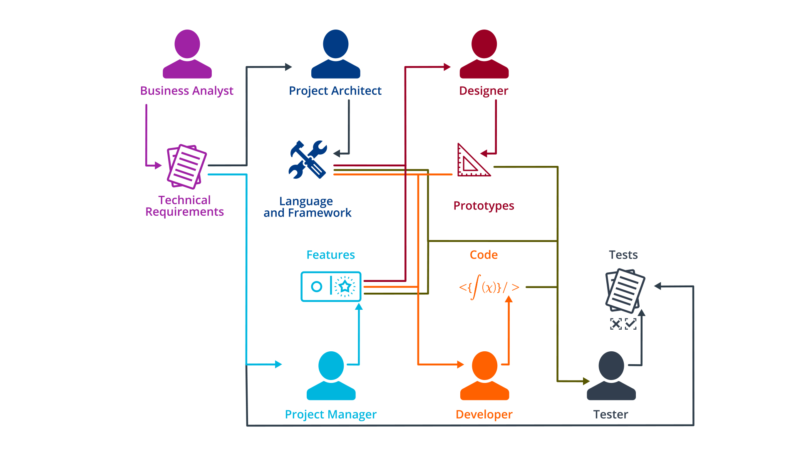
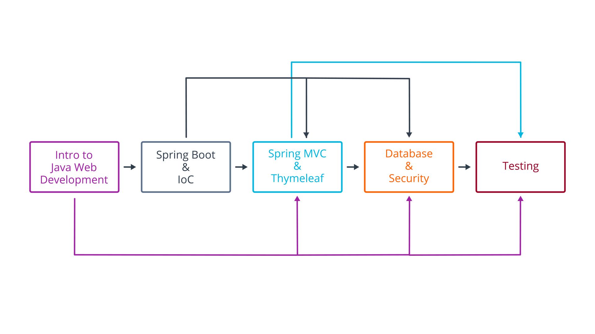
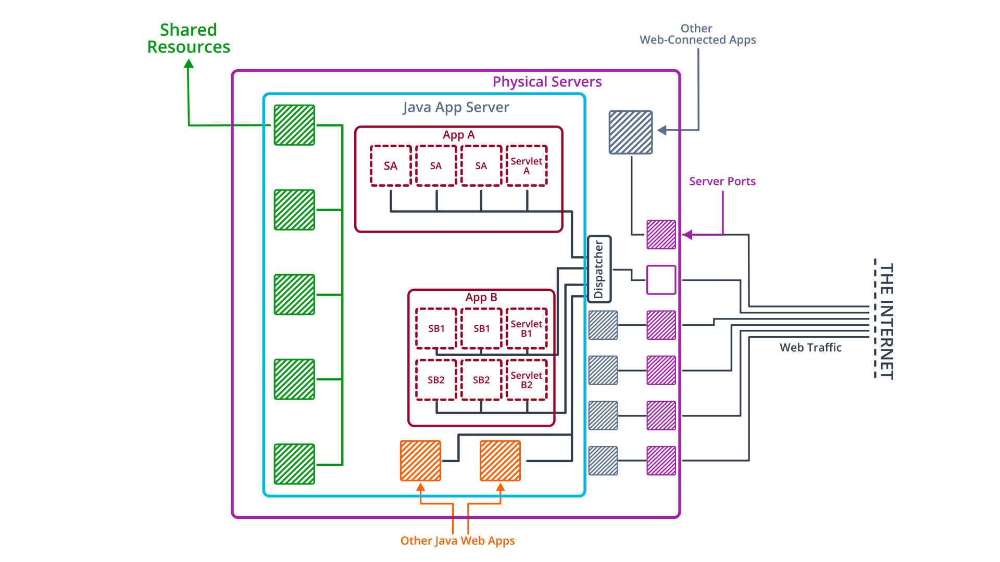
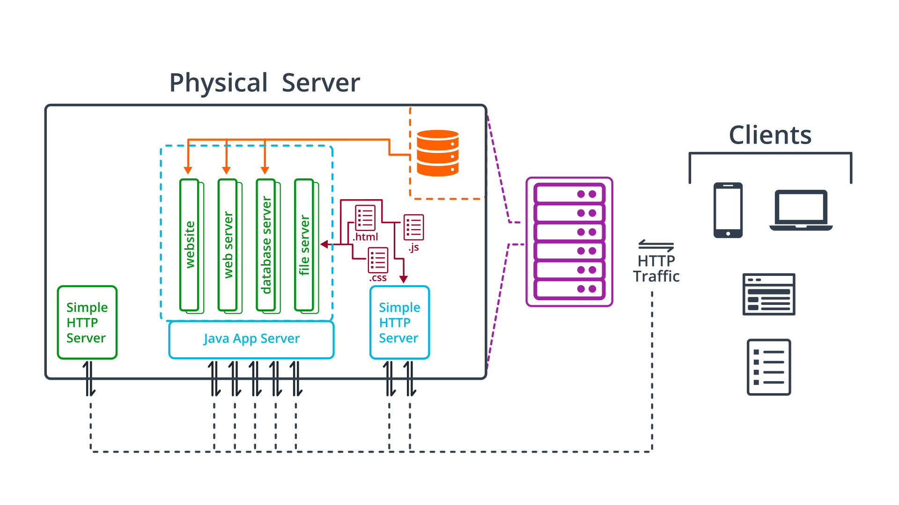
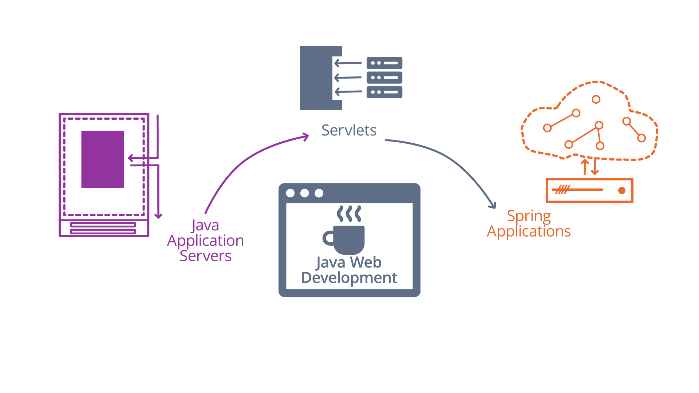

# Web Development

Web Development means building web applications, and in a standard web application, there are three main components:

- Data Storage
- Application Logic
- Client Access

By the end of the course, you're going to learn how to build and manage each of those components in Java using Spring Boot.

## Data Storage

Some of those beans will be responsible for interacting with the database. We will be using a SQL database called H2, which is an in-memory SQL database hosted by Spring Boot. You'll learn to use MyBatis, a Java library for database interaction, to generate data-access beans, which will be used by other services in your application logic to satisfy client requests.

## Application Logic

Application logic manages client access and database interaction. For this course, you're going to learn how to use Spring Boot to maintain a collection of beans, which are small components of application logic that can interact with each other to carry out complex tasks.

## Client Access

The client that will access our application is a web browser, which will send HTTP requests to our app and usually expects HTML in return. Using Spring MVC and Spring Security, libraries provided to us by Spring Boot, you will learn to create special beans called controllers that you can configure to respond to client requests and generate HTML responses. Controllers act as the entry points of your application, from a client's perspective.

## Why Learn Java and springboot

Learning web development is valuable because it's how the digital apps and services that we use every day are built. Being able to visualize the architecture of a web application will make you a better developer and give you tools to use when turning an app idea into reality.

Learning Java is valuable because it's a widely-used industry mainstay, and it has a massive community of developers and open-source projects, like Spring Boot. Learning Spring Boot matters because it's a core Java library that supports and defines language-wide best practices. Mastery of Spring will make you an excellent Java developer and expose you to the Java-standard solutions to a wide range of common problems. Learning to recognize those common problems will make you a better developer. Wherever you go, whatever language you use, the same problems will arise, and you'll know what kind of solutions to look for.

## Who are the Stakeholders

On a professional development team, many people are involved in the choice of language and framework:

- Developers who write the code.
- Testers who write and run tests.
- Designers who create prototypes for the developers to implement.
- Project Architects who choose the technologies best suited to a project's requirements
- Business Analysts who write technical specifications for the developers to follow.
- Project Managers who plan development efforts.

This course is for anyone in these roles who is looking to do web development with Java and Spring.

### Spring

Spring is a framework that encompasses many useful Java libraries for web development. Spring includes numerous essential web development "components", such as database access, security, cloud deployment, web services, and many more.

### Spring Boot

Spring Boot is a part of the Spring framework, which helps in rapid application development. Spring Boot helps to develop stand-alone and enterprise web applications. The advantage of using Spring Boot is that developers can get started with Spring's core libraries with a minimum configuration setup. Therefore, Spring Boot helps to speed up application development.

### Spring versus Spring Boot

Both Spring and Spring Boot frameworks help to build microservices-based web applications. Internally, the Spring Boot is built on top of the Spring framework. In general, the Spring (core module) takes care of the actions, such as:

- Inversion of Control (IoC)
- Dependency injection
- Common annotations
- Implements and provides the foundation for other frameworks, such as Thymeleaf, MyBatis, Spring MVC, and many others.

Whereas, Spring Boot brings all the functionality of Spring and some additional advantages, such as:

- It can automatically configure Spring and third-party libraries
- It provides necessary dependencies to ease the build configuration
This way, Spring Boot helps to speed up application development. It is a matter of software requirements to choose between Spring and Spring Boot frameworks. Either of the frameworks can be used to build microservices-based web applications. However, Spring Boot helps to get things done faster.

Don't worry if you didn't understand any terms used above; you will learn and practice each of these shortly in the next few lessons.

## Lesson 2

### Course Outline

- Basics of Java server architecture, dependency management in Java, and how Spring integrates with both.
- Core Spring principles. We'll be covering dependency injection, bean configuration, service development, and server-wide configuration.
- Spring MVC and Thymeleaf, an HTML template engine. We'll talk about Spring controllers, Thymeleaf template attributes, and connecting the two with the MVC pattern.
- Connecting your Spring app to a database and securing it with Spring Security. We'll cover the basics of ORM and MyBatis, an ORM tool for Java. We'll use the database to store user credentials securely and use them to authenticate users with Spring Security.
- Testing and web browser automation with Selenium. We'll cover how to set up and run tests with JUnit, how a web driver works, and how to simulate user actions in the browser with Selenium. We'll also discuss page objects, Selenium's powerful abstraction tool.

### Course Ahead

In this course, we're going to:

1 Build web apps with Java and Spring Boot.
2 Learn what a Java web server is and how to build applications for it with Spring.
3 Present our applications on the web with Thymeleaf and Spring MVC, and we'll connect to a database to store user data with MyBatis.
4 Learn how to secure our website with Spring Security and test it with JUnit and Selenium.
5 Together, these skills are going to allow us to build secure, maintainable, and reliable web applications with ease. You'll be capable of taking on any web development scenario with confidence, especially one that involves registering and authenticating users, storing user-submitted data, and allowing the user to access and edit their data through a web site. Something like a file-storage app, perhaps?

### How a Java Application Server Connects Applications to the Web

A web server's primary role is listening for HTTP requests and handling them with application logic, sending an HTTP response to the client that indicates the result of the operation. Simple HTTP servers host directories of HTML files directly, sending files in response to requests for specific URLs. This is enough for static websites with no dynamic server operations, but modern web apps support users accounts, complex interactions, and persistent data. Java application servers make these features more accessible by hosting many individual applications, managing them over a common interface, the servlet. This allows developers to focus on application logic and features, with HTTP request handling and routing handled by the server.

Spring provides additional sets of libraries that integrate with the servlet interface to provide applications with even more utilities that focus on database access, security, and HTML generation, and it's the tool we'll use to build our web applications. Find History [here](https://docs.spring.io/spring-framework/docs/current/reference/html/overview.html#overview-history)

### Web Development with Java

When building a web application, there are a lot of helpful tools that can solve common problems for you. How do you decide what you need to implement a given feature?

Since we're going to be building web apps with Java and Spring boot, the first step is to research what Spring supports and recommends for that feature. Spring's website includes documentation and examples for a wide range of features and libraries, and is a great place to start. Once you've decided on a library to use, the next step is finding its website and documentation. Most open-source libraries have extensive documentation that covers getting started, usage examples, and complete references. You can use these resources to implement your feature and debug issues along the way. Finally, if you encounter issues that documentation alone can't solve, you should search Google for to find similar issues and solutions others have encountered.

### Java Application Server

A Java Application Server is a pluggable architecture that can host many deployed applications at once. It provides utilities like multi-threading, request filtering, and resource sharing to each application. Those applications must expose endpoints that handle the requests routed to them by the server.

The structure of a Java Application Server. Just like any other web-connected program, it listens for incoming requests on one of the physical server's ports. Once it receives a request, it uses a _dispatcher_ to decide which application Servlet should receive the request. There may be many copies of any given servlet running at once so that multiple requests can be processed in parallel, and all of them have access to resources shared by the Application Server - like connections to a database.

Application servers provide utilities and resources to the applications they host, but they don't perform any of what we call business logic. You're going to have to write that yourself!

### Key Terms on Java Application Server

- **HTTP**: Hypertext Transfer Protocol. A binary protocol that originally defined the mechanics of requesting and sending HTML over the internet.

HTTP Request/Response: HTTP, or HyperTextTransferProtocol, is a binary data format for communication between programs over the web. It can be broken down into two basic message types: requests and responses. Clients send requests for resources to servers, which respond with the requested data. Read more about the protocol [here](https://developer.mozilla.org/en-US/docs/Web/HTTP/Messages).

HTTP GET and POST: Every HTTP request has an important header that determines its method. GET and POST are two of the most common; GET indicates a request for data from the server, and POST represents a request to "post" new data to the server - this usually represents some action on server data like submitting search terms, posting an update, or adding new data to the server.

- **Web Server**: A program that listens for and responds to HTTP requests over the internet

- **Application Server**: A program that hosts other applications, forwarding incoming requests to the appropriate application according to a filter. Provides shared access to resources and multi-threading.

- **Pluggable Architecture**: A pluggable architecture refers to any piece of software that allows parts of it to be added, replaced, and removed. Usually, this is achieved through a common interface for every "pluggable" component. Sometimes the architecture can even replace components at runtime, as is the case with Servlets in an Application Server.

- **Threads/Threading**: These terms come from concurrent programming - a thread is essentially one track of computation, and multi-threading is running multiple threads in parallel. This gets a little complicated because your CPU has a limited number of physical cores that can process instructions in parallel, while the number of threads you can have can be many more than your computer has cores, but that's a topic for another time!

### Further Research on Java Application Server

- Oracle documentation for [Java EE Containers/Servers.](https://javaee.github.io/tutorial/overview005.html#BNABO)

What’s the role of HTTP when your browser makes a request for a web page?

- HTTP is a protocol for formatting web requests so that your Application Server can understand them

> That’s right! Requests from the outside use HTTP so they can communicate with your Application Server. It handles the HTTP so your applications don’t have to!

## Java Servlets

Servlets are the interface between an application and the Java Application Sever it runs on which is part of the Java Enterprise Edition Specification

By implementing one or more servlets in your application, you provide endpoints for the server to send incoming requests to.
You can also configure your application to map certain web URLs to specific servlets which the server will enforce.

The Servlet class is the main connection between the apps you develop and the application server they run on. By extending Servlet, you can create endpoints that handle incoming requests in a way specific to your application needs, and you can map specific request URLs to specialized servlets by adding entries to a web.xml file. The app server uses this configuration to instantiate and manage your servlets. It interacts with each through three standard methods, init, service, and destroy:

service is where requests are handled, and the server will call this method when a request is routed to the servlet it's called on.
init is where initialization of the servlet is handled, and the server will call this method directly after instantiating the servlet.
destroy is where servlet resource cleanup is handled, and is called directly before the server terminates the servlet instance.

### The Lifecycle of a Servlet in an Application Server

The lifecycle of a Servlet in an Application Server. When application code is first loaded, the server looks for a `web.xml` file that identifies the servlets to be registered. The server then instantiates the servlets, calling their `init` methods to execute any required initialization code. While the servlets are active, the server forwards requests to each of them, calling their `service` methods to execute application logic. When a servlet is ready to be unloaded, the server first calls the servlet's `destroy` method, which executes any required clean up logic.

### A quick note on Java Application Files

When you compile a Java program and package it to be run, the Java compiler creates what is called a Java ARchive, or JAR file. This file contains a compressed file hierarchy, with folders that represent Java packages that contain Java .class files, which are the compiled versions of .java source code files. It can also contain arbitrary resource files, either at the root level or deeply nested in the package hierarchy. These files often contain metadata related to the app or library contained in the JAR file, which can be read by any program that interacts with the JAR.

When you want to deploy an app to an app server, you have to package it as a Web application ARchive, or WAR file. A WAR file is almost identical to a JAR file, but includes configuration files specific to web applications. When we copy a WAR file into the deployment directory of an app server, the server unpackages it, looks for a web.xml file, and uses that file to find the classes and resources required by the application. This uses advanced Java features like reflection and class loading to programmatically load Java class definitions and instantiate them which is quite a nifty trick! It allows us to dynamically load, start, stop, and replace any number of applications in a web server at any time.

### Key Terms on Java Servlets

- Endpoints: An endpoint is the address at which a client can reach a specific part of a server's functionality. Usually, this is a URL path, the /words/and/slashes that follow the domain of a URL, like .com or .org.
- Servlet: A class defined as a part of the Java: Enterprise Edition specification. Provides an implementable interface for web server request processing, defining a service method that the server invokes on an instantiated servlet to handle a ServletRequest and ServletResponse object for an incoming request. The servlet also defines lifecycle methods for the server to invoke when initializing or destroying a servlet.
- JAR: A Java Archive file, which stores compiled .class files in a folder hierarchy that matches the code's package structure. Includes an optional manifest file.
- WAR: A variation on the JAR for web applications, which optionally includes web resources like HTML files and configuration files like web.xml for servlet registration/mapping.

### Further Research on Java Servlets

- Official documentation of the [Servlet API](https://javaee.github.io/tutorial/servlets.html#BNAFD)
- Official documentation for the [Java JAR API](https://docs.oracle.com/en/java/javase/13/docs/api/java.base/java/util/jar/package-summary.html)
- Official documentation for [packaging WAR files](https://javaee.github.io/tutorial/packaging003.html#BCGHAHGD)

## Spring Applications

Spring is an application framework, which means that instead of choosing when to invoke it from your application, you choose when it invokes your application code. This pattern of software development is called Inversion of Control (IoC), and it's powerful because it allows developers to develop specialized application components and use Spring to connect them with each other using dependency injection. This is good for clean, separated code and for code reuse. This is evident when looking at the vast number of Spring modules and Spring-integrated third-party tools that are available. This course focuses on a few of them:

- Spring MVC, a generic web controller library for Spring that supports a wide variety of utilities to simplify the handling of HTTP requests
- Thymeleaf, a third party template engine that can integrate with Spring MVC to simplify the generation of web pages as responses to HTTP requests
- Spring Security, a generic authentication library for Spring that can integrate with many different credential sources and authentication protocols to automatically manage request authentication and security contexts
- MyBatis, a third-party database access library that provides simple SQL/Java mapping tools that can be defined in Spring components

### The End of Boilerplate: Spring Boot

So Spring adds a lot of features, but it still sounds like a lot of configuration. We still have to deploy it to an application server, right? And we still have to create a servlet for Spring to live in. It also sounds like getting all of these modules and utilities to work together might take some work.

In the past, Spring did require a lot of configuration, but over time, the development world has moved towards a convention-over-configuration approach. Spring Boot is a project that provides an a-la-cart Spring experience, complete with a web page for generating and downloading starter projects based on the application needs. Most Spring Boot applications today also contain an embedded application server with a default, pre-configured servlet definition. All you have to do to run your Spring-enabled code as a server is to run a main method.

With the rise of containerized architectures like Docker, this style of application development has become as popular as the pluggable application server, and in this course, we'll be exclusively using this mode. However, if you do want to deploy your Spring Boot application to a traditional application server, there are built-in tools that allow you to package the application as a standard WAR file.

### Key Terms on Spring Applications

- IoC: Inversion of Control, which is the practice of designing libraries as application runners. This allows developers to focus on application-specific logic and rely on IoC containers to connect application components with one another, eliminating a lot of boilerplate and encouraging a clean separation of development concerns.

### Further Research on Spring Applications

- Inversion of Control still seem a little hard to conceptualize? [Watch this video](https://www.youtube.com/watch?v=vFzP2SaMyA0) from Udacity for a dead-simple explanation of the basics.
- Official Spring framework [website](https://spring.io/).
- An [article](https://www.martinfowler.com/articles/injection.html) about Inversion of Control by Martin Fowler from the beginning of the pattern's popularity.

> Your Application Server manages as many Servlets as needed to receive HTTP requests. It can instantiate, call, and destroy Servlet instances. Spring does something similar with dependencies you define.

## Questions on Spring Applications

- What’s the relationship between Spring and a Java Application Server?
_**Answer:**_ Spring dispatches Servlet requests from the Application Server to specific Java code to handle requests. Spring makes it much simpler for our Java applications to communicate with the Application Server by serving as a go-between for Servlet requests.

- Inversion of Control is one of the main features of Spring. It allows Spring to manage instances of dependencies and provide them when needed. We could say that Spring’s ability to inject dependencies is just like the Application Server’s ability to provide what? 
_**Answer:**_  Servlets

- Spring provides a lot of additional features that can help us receive requests and create responses. What are some things Spring can help us do?
_**Answer:**_

## Spring Starter Packs Setup

Spring is a collection of open-source libraries that solve common web development problems. But how do we get those libraries? In this course, we'll be using Maven, a dependency management tool that lets us define dependencies on open-source libraries based on their names and version numbers. We define those in a file in our projects called pom.xml, which Maven reads and uses to download the required libraries. We can also have our projects inherit dependencies from some base project, which is a feature that Spring Boot uses to make setting up a new Spring project easy as pie. We'll be using Spring Initializr, an online project generator, to choose specific Spring dependencies to add to new Spring projects.

Spring Boot is best experienced with the help of Spring Initializr, an official project generator. You can use it to configure metadata and build properties of a project as well as what starter dependencies you want to include. These include:

- [Spring Dev Tools](https://docs.spring.io/spring-boot/docs/1.5.16.RELEASE/reference/html/using-boot-devtools.html): utilities including hot reloading changed code into a running application
- [Spring MVC](https://docs.spring.io/spring/docs/3.2.x/spring-framework-reference/html/mvc.html): web layer utilities that make developing server-side web apps easy
- [Spring Data](https://spring.io/projects/spring-data): a common interface for many different types of database access
- And [many more](https://spring.io/projects) Once you've selected your dependencies and chosen your language, build tool, and project identifiers, Spring Initializr will generate a zip file that includes a ready-to-run server with all of the choices you made reflected in its pom.xml file, as well as the package structure.

### Key Terms on Spring Starter Packs

- **Maven**: A dependency management system and project build tool for Java. Provides a standardized way to define dependencies between projects and include them in the project build path.
- **POM**: The **P**roject **O**bject **M**odel that Maven uses to represent the dependency and build configuration of a project. Usually, this refers to the pom.xml configuration file found in a Maven project.
- **Dependency Management System**: Any tool that automates the downloading and linking of external packages to a software development project. Most languages these days either provide one officially or have a community-accepted standard.

### Additional Resources on  Spring Starter Packs

Official Spring project generator: [Spring Initializr](https://start.spring.io/)

## Glossary

- **HTTP Request/Response**: HTTP, or HyperTextTransferProtocol, is a binary data format for communication between programs over the web. It can be broken down into two basic message types: requests and responses. Clients send requests for resources to servers, which respond with the requested data. Read more about the protocol here.
- **HTTP GET and POST**: Every HTTP request has an important header that determines its method. GET and POST are two of the most common; GET indicates a request for data from the server, and POST represents a request to "post" new data to the server - this usually represents some action on server data like submitting search terms, posting an update, or adding new data to the server.
- **HTTP**: Hypertext Transfer Protocol. A binary protocol that originally defined the mechanics of requesting and sending HTML over the internet.
- **Web Server**: A program that listens for and responds to HTTP requests over the internet
- **Application Server**: A program that hosts other applications, forwarding incoming requests to the appropriate application according to a filter. Provides shared access to resources and multi-threading.
- **Pluggable Architecture**: A pluggable architecture refers to any piece of software that allows parts of it to be added, replaced, and removed. Usually, this is achieved through a common interface for every "pluggable" component. Sometimes the architecture can even replace components at runtime, as is the case with Servlets in an Application Server.
- **Threads/Threading**: These terms come from concurrent programming - a thread is essentially one track of computation, and multi-threading is running multiple threads in parallel. This gets a little complicated because your CPU have a limited number of physical cores that can process instructions in parallel, while the number of thread you can have can be many more than your computer has cores, but that's a topic for another time!
- **Endpoints**: An endpoint is the address at which a client can reach a specific part of a server's functionality. Usually, this is a URL path, the /words/and/slashes that follow the domain of a URL, like .com or .org.
- **Servlet**: A class defined as a part of the Java: Enterprise Edition specification. Provides an implementable interface for web server request processing, defining a service method that the server invokes on an instantiated servlet to handle a ServletRequest and ServletResponse object for an incoming request. The servlet also defines lifecycle methods for the server to invoke when initializing or destroying a servlet.
- **JAR**: A Java Archive file, which stores compiled .class files in a folder hierarchy that matches the code's package structure. Includes an optional manifest file.
- **WAR**: A variation on the JAR for web applications, which optionally includes web resources like HTML files and configuration files like web.xml for servlet registration/mapping.
- **IoC**: Inversion of Control, which is the practice of designing libraries as application runners. This allows developers to focus on application-specific logic and rely on IoC containers to connect application components with one another, eliminating a lot of boilerplate and encouraging a clean separation of development concerns.
- **Maven**: A dependency management system and project build tool for Java. Provides a standardized way to define dependencies between projects and include them in the project build path.
- **POM**: The Project Object Model that Maven uses to represent the dependency and build configuration of a project. Usually, this refers to the pom.xml configuration file found in a Maven project.
- **Dependency Management System**: Any tool that automates the downloading and linking of external packages to a software development project. Most languages these days either provide one officially or have a community-accepted standard.

In this lesson, we learned about:

- **Web servers** and how early servers were single-function programs that could host files, serve web pages, and expose databases to external connections.
- **Java application servers**, which provides a pluggable architecture for applications to interface with, granting access to shared resources and multi-threaded request processing.
- **Spring framework**, a family of libraries that build on the abstractions of the application server to support many third-party integrations to provide easy abstractions for common web development tasks.
- **Spring Boot**, a convention-over-configuration approach to Spring app development that provides defaults for many Spring configuration options in order to provide a smoother development experience.
- **Spring Initializr**, the official project generator for Spring Boot, which allows developers to specify an application's metadata and dependencies and receive a fully-configured Spring Boot project, ready for development.
