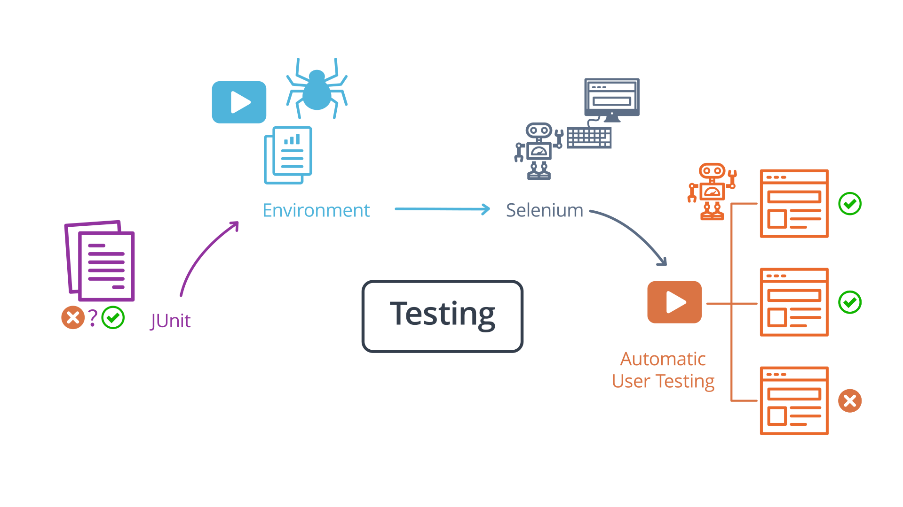
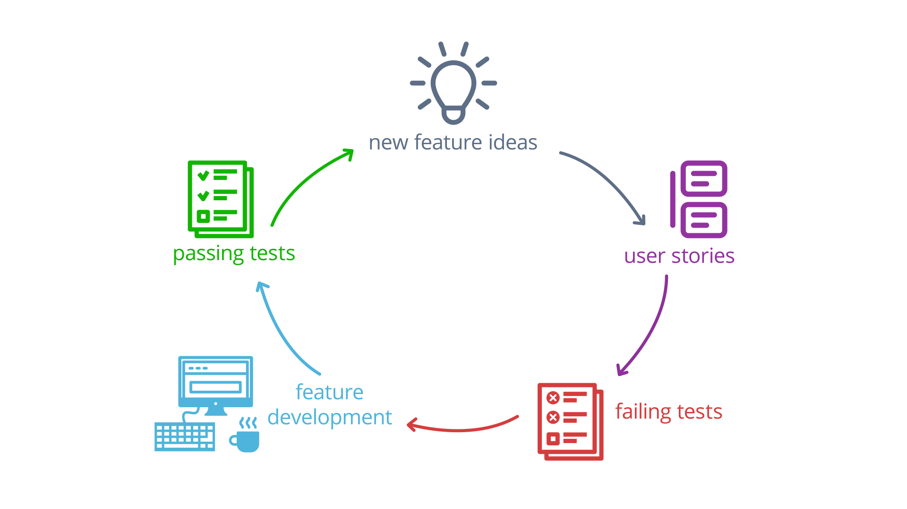
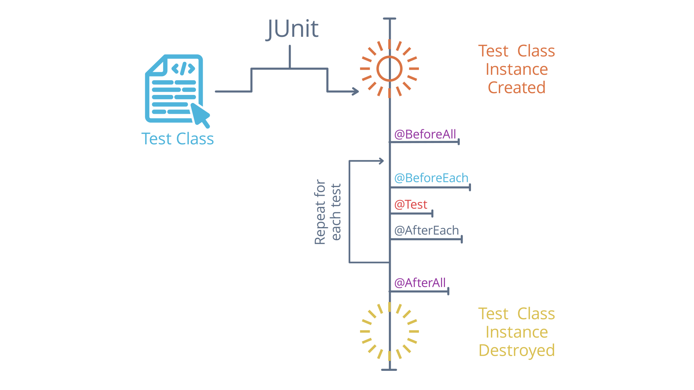
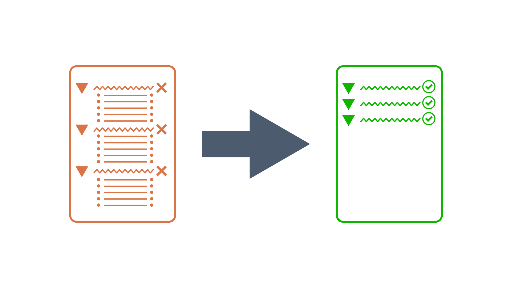
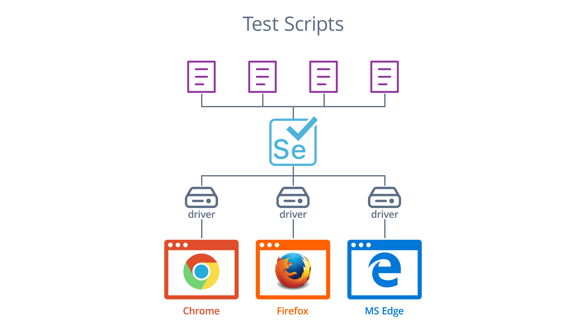

# Testing With JUnit and Selenium

## What to Learn



## Lesson Outline

* **Testing with JUnit**: We introduce JUnit, the standard testing and assertion framework for Java. We learn how to write new tests and check out assumptions by using JUnit's extensive library of assertion methods.
* **JUnit in Situ**: We look at how we can use IntelliJ (or any other IDE) to run tests, debug errors, and get reports about code coverage.
* **Selenium/WebDriver**: We introduce Selenium, a tool for browser automation, through its Java API, `selenium-java`. We look at how to write Selenium scripts to simulate user actions in a browser at a high level.
* **JUnit and Selenium**: We discuss how to use Selenium's java API inside of JUnit tests, which opens the door to an advanced technique: automated user testing.

## Testing: Why and How

### Test Driven Development Lifecycle



The figure above shows the test-driven development lifecycle. First, there is an idea for a new feature. That feature idea is turned into a series of user stories, which are then turned into tests, which fail because the feature does not exist yet. The developers then work on the feature's code requirements until all of the tests pass, and the cycle begins anew.

Testing is an important and highly desired part of the software development process. In a world where uptime and user retention means everything, it's important to validate that your application actually does what it's supposed to before it goes into production.

The standard accepted way to enforce this is by adopting a test-driven development lifecycle, or TDD. In this model, the "red then green" philosophy is dominant - tests should be written before the feature to be tested, meaning that they start off failing - aka, the tests are "red." Then, as the feature is implemented, one test after another should start to pass - aka, become "green."

To facilitate this approach, it's useful to have a standard way to describe features or requirements to be tested. For this, we turn to the concept of a "user story." A user story describes the functionality a feature should have from the perspective of a user interacting with the application. Typically, the format of a user story is:

**As a user, I can take some action in order to achieve some goal.**

Often a feature will be broken up into many user stories, each of which should correspond to at least one test to be implemented for that feature. If all the tests pass, it means that all of the user stories are successfully implemented, and the feature is complete.

### Key Terms on Why and How to Test

* **Test Driven Development**: a software development methodology that emphasizes writing tests before the code to be tested. This gives developers a roadmap to success - once all the tests are passing, the feature is complete!
* **User Story**: User stories are short sentences derived from feature requirements in the format of As a user, I can in order to . These are used to create tests to verify the components of a feature.

## Testing: Integration and Unit Testing Methods

There are many different types of tests meant to validate different types of features and different layers of an application. In this course, we're going to focus on two specific types of tests: Unit tests and integration tests.

Unit tests are meant to test a single unit or component of an application or process - these tests should be simple, and verify that a specific method, component, or process step acts as expected according to its inputs. Sometimes you'll also use unit tests to verify that the unit under test fails predictably, as well; it's good to test both positive and negative conditions in a unit test!

Integration tests are the next layer up from unit tests. Instead of testing a single unit of an application, they test multiple units and how they integrate with one another. Often, an integration test will validate an entire user story, for example, while a unit test will validate a single step in the process a user story describes.

> The rule of thumb is that unit tests should be used to test invariants - conditions that do not change - and integration tests should be used to test user actions and entire process flows .

### Key Terms on Integration and Unit Testing Methods

* **Unit Tests**: A unit test only validates the smallest unit of a computational process. That might mean a test of a single method, or a single component in an application.
* **Invariants**: An invariant is a law of computation, something that shouldn't change despite changing circumstances. For example, adding 0 to a number should always result in the original number, and dividing by 0 should always result in an error.
* **Integration Tests**: Integration tests are intended to validate the operation of multiple application components as they interact with each other - or integrate with one another.

## Testing with JUnit

Unit is the standard Java testing framework, and despite its name, it is capable of much more than unit tests. JUnit expects all tests for an application to be collected in class files, just like any other Java code.

### Annotations

JUnit provides an annotation, `@Test`, that can be placed on a method in a test class to declare a single test. Each method annotated like this can be either executed individually, or in a group - and in both cases, JUnit will generate a report that lists each test that was run, and whether it was successful or not.

In order for JUnit to know if a test is successful or not we need to use assertions. `@Test`-annotated methods should not have a return value! Instead, we can use special methods provided by JUnit to check our assumptions about the code under test. We'll look at a concrete example of this in the next video. To begin with, see the list of all annotations [here](https://junit.org/junit5/docs/current/user-guide/#writing-tests-annotations).

Sometimes, we need to initialize some data or objects to be used in our test methods. JUnit provides a few extra annotations to define this initialization code. `@BeforeEach`- and `@AfterEach`-annotated methods will be called before an after each `@Test`-annotated method, respectively, and `@BeforeAll`- and `@AfterAll`-annotated methods will be called at the before and after all tests have been executed, respectively.

### Assertions

An assertion, in the context of JUnit, is a method we can call to check our assumptions about the behavior of the unit under test. If our assumptions are correct, the assertion silently returns and the test method continues. If they're false, the assertion throws a special exception class that JUnit uses to build the final failure report, and the test method halts execution.

> Assertions are the static methods defined in the Assertion class. See the list of assertions [here](https://junit.org/junit5/docs/current/api/org.junit.jupiter.api/org/junit/jupiter/api/Assertions.html), and an example on how to use assertions in a unit test [here](https://junit.org/junit5/docs/current/user-guide/#writing-tests-assertions).

For example, `assertEquals(int expected, int actual)` is an assertion method you can call in your test method to assert that the actual and expected integer values are equal. Let's see an example implementation of annotations and assertions next.

```java
// Test Class 

    private List<Integer> testList;

    @BeforeEach
    public void beforeEach() {
        testList = new ArrayList<>();
        testList.add(1);
        testList.add(2);
        testList.add(3);
    }

    @AfterEach
    public void afterEach() {
        testList = null;
    }

    @Test
    public void testAddZero() {
        int a = 10;
        int b = 0;
        int c = a + b;
        assertEquals(a, c);
    }

    @Test
    public void testDivideZero() {
        int a = 10;
        int b = 0;
        assertThrows(ArithmeticException.class, () -> {
            int c = a / b;
        });
    }

    @Test
    public void testListContains() {
        assertTrue(testList.contains(1));
        testList.remove(0);
        assertFalse(testList.contains(1));
    }
```

Some key takeaways from the code above:

* In a Maven project, it's extremely important to make sure your JUnit test classes are in the right directory. Maven expects tests to be in the `src/test/java` directory. _Always double check!_
* JUnit's assertions are all static methods on the `org.junit.jupiter.api.Assertions` class, so to use them you need to statically import the methods you need
* The most commonly-used assertion is `assertEquals`, which can be used to check if the result of some action is equal to the expected result.
* Another common assertion is `assertThrow`s`, which is used to check if a given piece of code does throw an exception as expected. This can be useful to check so-called negative test cases, where we want to make sure our application fails in the correct way. This assertion uses Java 8's lambda expression syntax to capture a piece of code to test - if you're not familiar with this syntax, you can find more information about it in the further research section below.
* `@BeforeEach`-annotated methods are particularly useful for initializing some data that needs to be in the same state for every test. For example in the video, we used this to ensure that a list under test always has the same values at the beginning of each test.



The diagram above shows the lifecycle of a JUnit test class.

* First, JUnit instantiates the class and calls any method annotated with `@BeforeAll`.
* Then it chooses a test to run. It calls any method with the `@BeforeEach` method, then it calls the `@Test`-annotated test method.
* Finally it calls the `@AfterEach`-annotated method. It repeats this for each `@Test`-annotated method in the class.
* When none remain, it calls the `@AfterAll`-annotated method and destroys the test class instance.

### Further Research on JUnit Testing

* [Official JUnit User Guide](https://junit.org/junit5/docs/current/user-guide/)
* [Official Java Tutorial on Java 8's Lambda Expression Syntax](https://docs.oracle.com/javase/tutorial/java/javaOO/lambdaexpressions.html)

## JUnit in IDE

When we write tests, it's with the intention to run them and report on the results. Test runners like JUnit provide many ways to report the results of a test run, but one of the most useful ways to interact with that reporting is through an IDE, like IntelliJ.

There are three main advantages to running JUnit tests from an IDE:

* **Interactive Reporting**: When we run tests in an IDE, we can usually inspect the results of each test individually. If an assertion fails or an unexpected exception is triggered, the stack trace and circumstances will be shown in the details for each test, and clickable links in the results help you navigate to problem areas in your code.
* **Interactive Debugging**: When a pernicious problem persists, it can often be helpful to step through the code's execution line-by-line to inspect both the control flow and the values in memory used by the program. This is called debugging, and while it's technically possible to do outside of an IDE, IDEs like IntelliJ provide many useful tools for making the process as painless as possible.
* **Code Coverage Reports**: When we run code in an IDE like IntelliJ, we can choose to have the IDE track which lines of our code were visited, and how many times. This can be wildly useful when trying to track down why a branch of a condition isn't being reached, as well as when determining how much the entire code base is covered by the currently-implemented tests.

### Red, Then Green: The Test-Driven-Development Motto



### Key Terms on JUnit in IDE

* **Interactive Reporting**: When we run tests in an IDE, we can usually inspect the results of each test individually. If an assertion fails or an unexpected exception is triggered, the stack trace and circumstances will be shown in the details for each test, and clickable links in the results help you navigate to problem areas in your code.
* **Interactive Debugging**: When a pernicious problem persists, it can often be helpful to step through the code's execution line-by-line to inspect both the control flow and the values in memory used by the program. This is called debugging, and while it's technically possible to do outside of an IDE, IDEs like IntelliJ provide many useful tools for making the process as painless as possible.
* **Code Coverage Reports**: When we run code in an IDE like IntelliJ, we can choose to have the IDE track which lines of our code were visited, and how many times. This can be wildly useful when trying to track down why a branch of a condition isn't being reached, as well as when determining how much the entire code base is covered by the currently-implemented tests.

### Further Research on JUnit in IDE

* [An Overview of IntelliJ's Test Running Features](https://www.jetbrains.com/help/idea/performing-tests.html)
* [An Overview of All of the Annotations Available in JUnit](https://junit.org/junit5/docs/current/user-guide/#writing-tests-annotations)
* [An Overview of Most of the Assertions Available in JUnit](https://junit.org/junit5/docs/current/user-guide/#writing-tests-assertions)

## Selenium/WebDriver

### The Architecture of Selenium



The figure above shows the architecture of selenium. Test scripts written using Selenium's Java API are translated by Selenium to work on different browsers using different drivers.

```xml
        <dependency>
            <groupId>org.seleniumhq.selenium</groupId>
            <artifactId>selenium-java</artifactId>
            <version>3.141.59</version>
        </dependency>
        <dependency>
            <groupId>io.github.bonigarcia</groupId>
            <artifactId>webdrivermanager</artifactId>
            <version>3.8.1</version>
        </dependency>
```

```java
// SeleniumExample.java
import io.github.bonigarcia.wdm.WebDriverManager;
import org.openqa.selenium.By;
import org.openqa.selenium.WebDriver;
import org.openqa.selenium.WebElement;
import org.openqa.selenium.chrome.ChromeDriver;

import java.util.List;

public class SeleniumExample {

    public static void main(String[] args) throws InterruptedException {
        WebDriverManager.chromedriver().setup();
        WebDriver driver = new ChromeDriver();
        driver.get("http://www.google.com");
        WebElement inputField = driver.findElement(By.name("q"));
        inputField.sendKeys("selenium");
        inputField.submit();
        List<WebElement> results = driver.findElements(By.cssSelector("div.g a"));
        for (WebElement element : results) {
            String link = element.getAttribute("href");
            System.out.println(link);
        }
        Thread.sleep(5000);
        driver.quit();
    }

}
```

Every Selenium script has to start by initializing a web driver. Since we're using WebDriverManager (documentation links below), we can use it to automatically download the binary file for Selenium's driver for Google Chrome, and then we can initialize the driver without any additional work.

Once we have a driver, we need to tell it which web page to visit. We do this with `driver.get("http://www.google.com");` in the script, but if we were testing one of our own applications, like the message page from earlier this course, we would have to change the URL to something like `http://localhost:8080/home`.

In order to interact with or extract data from the web page, we first need to select the required HTML elements on the page. In this example, we use `driver.findElement(By.name("q"));` to select the google search input element. A detailed explanation of this process can be found below.

In order to interact with the elements we've selected, we can call various methods on them. In this case, we're using `inputField.sendKeys("selenium");` to simulate typing the word selenium into google, and we're using `inputField.submit();` to simulate submitting the search form.

Once we've interacted with the web page, we want to read in the results and print them out. Again, we use the same process for finding an element, but this time, we use `driver.findElements()` to get a list of matching elements, instead of a single one.

The final part of every Selenium script is shutting down the driver. Since the driver is an external program, if we don't call `driver.quit()`, the automated browser window will never close on its own.

### Key Terms on Selenium and Web Drivers

* **Web Driver**: In order for Selenium to assume control of a browser, it needs a program to interface with the specific browser's API. This program is called a web driver, and there are different web drivers for each major browser.

### Further Research on Selenium and Web Drivers

* **[WebDriverManager on Github, with Documentation on Its Use and Motivation](https://github.com/bonigarcia/webdrivermanager)**
* [Official Selenium Documentation on Finding Elements on a Web Page, with Code Examples](https://www.selenium.dev/documentation/en/getting_started_with_webdriver/locating_elements/)
* [DOM: Overview and the fundamental data types](https://developer.mozilla.org/en-US/docs/Web/API/Document_Object_Model/Introduction)

## JUnit and Selenium

Selenium and JUnit are a natural fit for one another. Both are plain Java libraries, and don't require any special syntax or approach to integrate with one another. We can use Selenium's driver to navigate the web, interact with elements on the page, and extract data from those elements, and we can use JUnit's assertions to check the data that is returned against expected values.

Selenium also requires some initialization logic, like setting up the web driver and navigating to the correct URL to perform further actions on. JUnit's `@BeforeAll` annotation is perfect for writing a method to initialize the web driver, and we can use the `@BeforeEach` annotation to write a method that navigates to a common starting URL for all tests in the class. Finally, since we need to make sure we quit the web driver once our tests are finished, we can use JUnit's `@AfterAll` annotation to define a method that takes care of that.

Selenium provides another useful tool for JUnit test organization - the **Page Object**. A Page Object is a Java class that is meant to represent a specific web page under test. We can use Page Objects to reduce boilerplate when writing Selenium scripts, and, as we'll see in the next video, we can even use them to make our test code resemble the user stories under test.

Sample Page Object is Shown below:

```java
   public class CounterPage {

      @FindBy(id = "count-display")
      private WebElement countDisplay;

      @FindBy(id = "increment-button")
      private WebElement incrementButton;

      @FindBy(id = "reset-value-field")
      private WebElement resetValueField;

      @FindBy(id = "reset-button")
      private WebElement resetButton;

      public CounterPage(WebDriver driver) {
         PageFactory.initElements(driver, this);
      }

      public int getDisplayedCount() {
         return Integer.parseInt(countDisplay.getText());
      }

      public void incrementCount() {
         incrementButton.click();
      }

      public void resetCount(int value) {
         resetValueField.clear();
         resetValueField.sendKeys(String.valueOf(value));
         resetButton.click();
      }
   }
```

There are three main sections to this, and any, Page Object:

* Defining Element Selectors
* Initializing Elements in the Constructor
* Creating Helper Methods

### Defining Element Selectors

```java
   @FindBy(id = "count-display")
   private WebElement countDisplay;

   @FindBy(id = "increment-button")
   private WebElement incrementButton;

   @FindBy(id = "reset-value-field")
   private WebElement resetValueField;

   @FindBy(id = "reset-button")
   private WebElement resetButton;
```

The goal of a Page Object is to simplify and abstract away common Selenium tasks, like finding elements on the page. Previously, we did this with `driver.findElement` and `driver.findElements`, but in a Page Object, we can take a much more Spring-like approach by declaring annotated fields representing the elements we want to capture on the page. These element selectors will be automatically processed by Selenium, but we have to kick that process off ourselves - which we do in the next section:

### Initializing Elements in the Constructor

```java
   public CounterPage(WebDriver driver) {
      PageFactory.initElements(driver, this);
   }
```

In this example, we declare a WebDriver as the only constructor argument, and we call `PageFactory.initElements()` with the driver and the `this` keyword as arguments. This is shorthand to tell Selenium to use the given driver to initialize the `@FindBy`-annotated fields in the class. In principle, we could do this somewhere else, but as we'll see in the next video, initializing a Page Object in its constructor like this is pretty flexible and clean.

By adding this constructor, whenever we create a new `CounterPage` object, Selenium will automatically find and capture the elements we declared, reducing a bunch of similar calls to `driver.findElement` to a single `new CounterPage()` instantiation. Once we have those elements, we can move on to the next section:

### Creating Helper Methods

```java
   public int getDisplayedCount() {
        return Integer.parseInt(countDisplay.getText());
    }

    public void incrementCount() {
        incrementButton.click();
    }

    public void resetCount(int value) {
        resetValueField.clear();
        resetValueField.sendKeys(String.valueOf(value));
        resetButton.click();
    }
```

Now that our Page Object has selected elements from the page it represents, we can define helper methods that encapsulate common tasks for the page. In this counter example, we need to be able to read the current count from the screen, we need to be able to increment the count, and we need to reset the count. Notice that I didn't mention any specific elements to describe the functionality of these actions - while we have to be specific in our implementation of these methods, as you can see in the code above, the goal of writing these helpers is to separate the action taken on the class from the specific element interactions required to fulfill that action. In some ways, this is another instance of separation of concerns - by hiding the implementation details in these methods, if the HTML of the page ever changes, we don't have to update anything except the code inside this class - the tests that will use this class can just continue to call the same methods they did before.

Speaking of tests - now that we've set up the `CounterPage` class, we can finally implement some tests for this app.

```java
   @SpringBootTest(webEnvironment = SpringBootTest.WebEnvironment.RANDOM_PORT)
   class UserTestingApplicationTests {
      @LocalServerPort
      private Integer port;

      private static WebDriver driver;
      private CounterPage counter;

      @BeforeAll
      public static void beforeAll() {
         WebDriverManager.chromedriver().setup();
         driver = new ChromeDriver();
      }

      @AfterAll
      public static void afterAll() {
         driver.quit();
      }

      @BeforeEach
      public void beforeEach() {
         driver.get("http://localhost:" + port + "/counter");
         counter = new CounterPage(driver);
      }

      @Test
      public void testIncrement() {
         int prevValue = counter.getDisplayedCount();
         counter.incrementCount();
         assertEquals(prevValue + 1, counter.getDisplayedCount());
      }

      @Test
      public void testIncrementTenTimes() {
         int prevValue = counter.getDisplayedCount();
         for (int i = 0; i < 10; i++) {
               assertEquals(prevValue + i, counter.getDisplayedCount());
               counter.incrementCount();
         }
      }

      @Test
      public void testReset() {
         counter.resetCount(10);
         assertEquals(10, counter.getDisplayedCount());
         counter.resetCount(0);
         assertEquals(0, counter.getDisplayedCount());
      }

   }
```

There are a few things we have to do to set up a test file for a Spring Boot app. The main thing is that we have to make sure our server is running before the tests start - we do that here with `@SpringBootTest(webEnvironment = SpringBootTest.WebEnvironment.RANDOM_PORT)`. This tells JUnit to run the application before any tests are executed, with a random port number instead of the default `8080`. This is useful because it means we can have multiple copies of the app running at the same time, which is common in development and testing environments.

Of course, we need to know what the random port ends up being so that we can use Selenium's `driver.get()` method to navigate the browser to our app. Spring makes this easy for us with the `@LocalServerPort` annotation. Spring will inject the current port into a field annotated with this like the example above.

As we mentioned in the video, we set up the Selenium driver in an `@BeforeAll` method, and we quit it in an `@AfterAll` method. However, the magic really starts with the `@BeforeEach` method - here, we navigate to the `/counter` URL and initialize a new `CounterPage` object. This means that every test will start from this URL and with a fresh `CounterPage object` - which makes test development extremely simple.

As you can see from the rest of the tests, we simply use the helper methods we defined on `CounterPage` to perform all actions in and retrieve all data from the browser. This makes our test code highly legible, and each test starts to look a lot like a user story - for example, for increment, we could read the test as

> **As a user, I can increment the count in order to see the displayed count increase by one**

And the code doesn't look far off from that statement! That's a truly powerful abstraction.

### Key Terms on JUnit and Selenium

* **Page Object**: a special POJO variant that can be defined for use with Selenium. A Page Object should have `@FindBy`-annotated fields that represent the key HTML elements under test, and should have helper methods that define high-level utilities and user actions on the page under test.

### Further Research on JUnit and Selenium

* [Official Selenium Guide to Using Page Objects](https://www.selenium.dev/documentation/en/guidelines_and_recommendations/page_object_models/)

## Selenium Page Load Times

In the real world, things get complicated, fast. Nowhere is this more apparent than when trying to account for page load times when automating user testing.

On the web, page load times can vary wildly according to different internet providers, the size of the resources a page has to load, the speed at which the server handles requests, and so on. It's virtually impossible to predict exactly when a page will load, and this presents a problem for testing; if we ask Selenium to find an element on a page before the page finishes loading, it's going to fail and we're going to have something like a big, fat `NullpointerException` or a `StaleElementReferenceException` on our hands. The [StaleElementReferenceException](https://developer.mozilla.org/en-US/docs/Web/WebDriver/Errors/StaleElementReference#:~:text=When%20an%20element%20is%20no,it%20was%20retrieved%20from%20navigates.) may occur in case of a delayed-reload.

So how do we make sure an element is on the page before we ask Selenium to look for it?

The answer is to use a `WebDriverWait`, which is a class Selenium provides just for this purpose. Let's look at the following code:

```java
   WebDriverWait wait = new WebDriverWait(driver, 10);
   WebElement marker = wait.until(webDriver -> webDriver.findElement(By.id("page-load-marker")));
```

In this example, we create a new `WebDriverWait` instance using a driver and a timeout in seconds. `WebDriverWait` defines a method called `until` that we use in the next line to force Selenium to pause _until_ the specified element is found, or the timeout is reached.

This is extremely handy, since we can now ensure that Selenium waits and continues in a structured way.

### Further Research Selenium Page Load Times

* [Official Selenium Guide to Waits](https://www.selenium.dev/documentation/en/webdriver/waits/)

### Glossary

* **Test Driven Development**: a software development methodology that emphasizes writing tests before the code to be tested. This gives developers a roadmap to success - once all the tests are passing, the feature is complete!
* **User Story**: User stories are short sentences derived from feature requirements in the format of As a user, I can in order to . These are used to create tests to verify the components of a feature.
* **Unit Tests**: A unit test only validates the smallest unit of a computational process. That might mean a test of a single method, or a single component in an application.
* **Invariants**: An invariant is a law of computation, something that shouldn't change despite changing circumstances. For example, adding 0 to a number should always result in the original number, and dividing by 0 should always result in an error.
* **Integration Tests**: Integration tests are intended to validate the operation of multiple application components as they interact with each other - or integrate with one another.
* **Assertion**: an assertion, in the context of JUnit, is a method we can call to check our assumptions about the behavior of the unit under test. If our assumptions are correct, the assertion silently returns and the test method continues. If they're false, the assertion throws a special exception class that JUnit uses to build the final failure report, and the test method halts execution.
* **Interactive Reporting**: When we run tests in an IDE, we can usually inspect the results of each test individually. If an assertion fails or an unexpected exception is triggered, the stack trace and circumstances will be shown in the details for each test, and clickable links in the results help you navigate to problem areas in your code.
* **Interactive Debugging**: When a pernicious problem persists, it can often be helpful to step through the code's execution line-by-line to inspect both the control flow and the values in memory used by the program. This is called debugging, and while it's technically possible to do outside of an IDE, IDEs like IntelliJ provide many useful tools for making the process as painless as possible.
* **Code Coverage Reports**: When we run code in an IDE like IntelliJ, we can choose to have the IDE track which lines of our code were visited, and how many times. This can be wildly useful when trying to track down why a branch of a condition isn't being reached, as well as when determining how much the entire code base is covered by the currently-implemented tests.
* **Web Driver**: In order for Selenium to assume control of a browser, it needs a program to interface with the specific browser's API. This program is called a web driver, and there are different web drivers for each major browser.
* **Page Object**: a special POJO variant that can be defined for use with Selenium. A Page Object should have `@FindBy`-annotated fields that represent the key HTML elements under test, and should have helper methods that define high-level utilities and user actions on the page under test.
