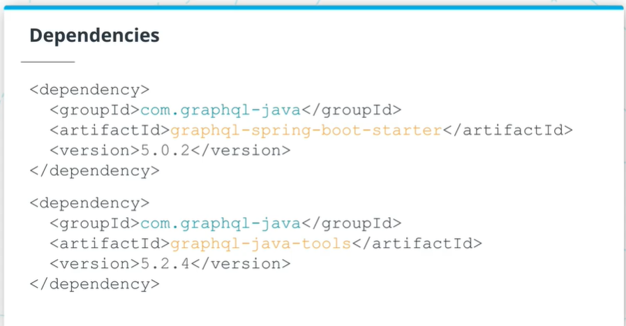
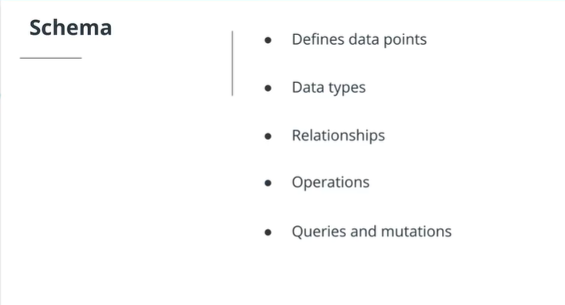

# GraphQL APIs

## GraphQL: An Overview

Rest is popular however it has challenges

- it's response is rigid
- It returns all data points as designed by the developer
- GraphQL offers flexiility in the response returnes

[GraphQL](https://graphql.org/) is a query language for APIs or a syntax that describes how to ask for data and is generally used to load data from a server to a client. GraphQL offers maximum efficiency and flexibility because it allows the calling client to specify exactly what data it needs.

It allows for the aggregation of data from multiple sources on the backend allowing the client to make one call and get all the data it needs

### Dependencies



To include GraphQL in your project, a couple of dependencies are needed:

- **graphql-spring-boot-starter** - This starter is very helpful because it will add and automatically configure a GraphQL Servlet that you can access at /graphql . This starter will also use a GraphQL schema library to parse all schema files found on the classpath. The starter will also set up an endpoint that can access POST requests.

- **graphql-java-tools** - A helper library to parse the GraphQL schema.

## GraphQL Schemas



The GraphQL schema defines the data points offered via an API. The schema contains the data types and relationships between them and the set of operations available, things like queries for retrieving data and mutations for creating, updating, and deleting data.

The schema from the Case Study is shown below.

```graphql

    type Location {
    id: ID!
    name: String!
    address: String!
    }

    type Query {
    findAllLocations: [Location]!
    }

    type Mutation {
    newLocation(name: String!, address: String) : Location!
    deleteLocation(id:ID!) : Boolean
    updateLocationName(newName: String!, id:ID!) : Location!
    }

```

> There can only be one root Query and one root Mutation type in a schema file.

## GraphQL Operations

GraphQL offers operations on data like queries and mutations.

**Queries**
A query allows for the retrieving of data. Each query will have a specific object that it returns and based on the object returned, you can add or remove fields to match the exact data you need to fit your specific use case.

**Mutations**
GraphQL has the ability to update the data stored on the server, by means of mutations. Mutations, such as, create, update, or delete will change the data, unlike a query.

A tool called GraphiQL is a simple web app that is able to communicate with any GraphQL Server and execute queries and mutations against it.

## Classwork

For this lesson the classwork done is contained in the file ClassWork - ****/Class Work/dogData/**
