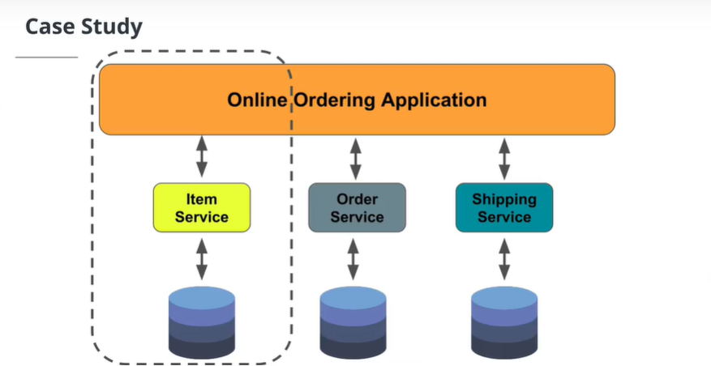

# GraphQL APIs

## Microservices: An Overview

N-Tier and monolithic applications used to be the de facto standard. In one single binary web artifact, like an EAR or WAR file, there would be a layered architecture with the decomposition of code into more functional components.

- Presentation Layer
- Business Process Layer/Service Layer
- Data Access Layer

There are several disadvantages to the n-tier monolithic application architecture:

- Tight coupling of code which makes changes hard.
- A single deployment with multiple layers that causes long testing, building, and deployment cycles.
- A big monolithic application that makes code reuse and sharing of components difficult.

The Microservices Architecture (MSA) decomposes systems into discrete, individual, standalone components that can communicate amongst themselves, working together or with external systems.

MSA is a more agile framework that fits well with the cloud-based world and lends itself well to web application development and web service development.

### Features

- MSA is very flexible because it supports any language that can communicate via a RESTful endpoint and leverages REST over HTTP.
- MSA offers agility and systems that are easier to write, test, deploy, and share.
- MSA provides systems that can better scale to load and demand.
- MSA provides systems that are resilient because failures are isolated and don’t cascade through the infrastructure.

## Spring Data Rest

Spring Data REST makes it easy to expose microservices. Spring Data REST builds on top of Spring Data repositories and automatically exports those as REST resources.

So how does Spring Data Rest work?

1. At application startup, Spring Data Rest finds all of the spring data repositories
2. Then, Spring Data Rest creates an endpoint that matches the entity name
3. Next, Spring Data Rest appends an S to the entity name in the endpoint
4. Lastly, Spring Data Rest exposes CRUD (Create, Read, Update, and Delete) operations as RESTful APIs over HTTP

There is no need to create a controller or service layer!

### Further Study on Microservices

- <https://www.section.io/engineering-education/introduction-to-microservices-with-spring-and-eureka/>

## Classwork

For this lesson the classwork done is contained in the file ClassWork - ****/Class Work/dogData/**
