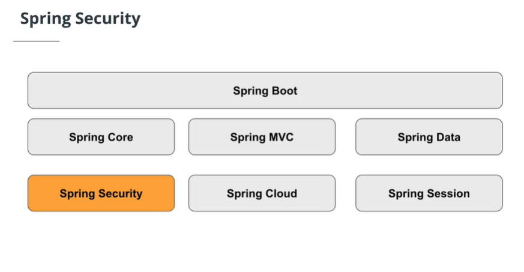
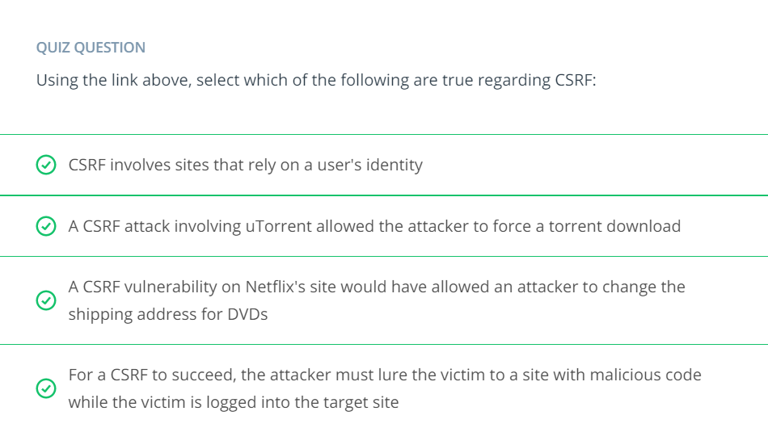

# Security

When allowing access to data via web services, security is very important. We want to limit who can view or even update data; only trusted individuals should have access.

If an unsecure call is made to a webservice, that request is rejected.

**Authentication**
Authentication is about validating the identity of a client attempting to call a web service. Typically, identity is validated with user credentials, such as a user name and password.

**Authorization**
Authorization is the next step after authentication. So once a client is authenticated (they have proven who they are), what do they have access to? For example, what data can they view, are they allowed to change that data, etc.

Basic Authentication (also referred to as Basic Auth) is the simplest protocol available for performing web service authentication over HTTP protocol. Basic Auth requires a username and password. The client calling the web service takes these two credentials, converts them to a single [Base 64–encoded value](https://en.wikipedia.org/wiki/Base64) and passes it along in the Authentication HTTP header.

The server compares the credentials passed to those stored. If it matches, the server fulfills the request and provides access to the data. If the Authentication HTTP header is missing or the password doesn’t match the user name, the server denies access and returns a 401 status code, which means the request is Unauthorized.

API Key Technique is another method employed to secure a webservice, it allows an API to be accessed via a Unique key. This unique key can be likened to the passcode to unlocking your mobile device.

## Spring Security

Spring Security is a part of the Spring Framework and provides authentication, authorization and other security features for Spring-based applications.

Item | Description
------ | -------
spring-boot-starter-security | Maven dependency that adds security module.
------ | -------
@EnableWebSecurity | Annotation that enables Spring Security’s support.

## CSRF - Cross Site Request Forgery

Cross-site request forgery, also known as one-click attack or session riding and abbreviated as CSRF (sometimes pronounced sea-surf) or XSRF, is a type of malicious exploit of a website where unauthorized commands are submitted from a user that the web application trusts. There are many ways in which a malicious website can transmit such commands; specially-crafted image tags, hidden forms, and JavaScript XMLHttpRequests, for example, can all work without the user's interaction or even knowledge. Unlike [cross-site scripting](https://en.m.wikipedia.org/wiki/Cross-site_scripting) (XSS), which exploits the trust a user has for a particular site, CSRF exploits the trust that a site has in a user's browser.

> Unlike cross-site scripting (XSS), which exploits the trust a user has for a particular site, CSRF exploits the trust that a site has in a user's browser.

In a CSRF attack, an innocent end user is tricked by an attacker into submitting a web request that they did not intend. This may cause actions to be performed on the website that can include inadvertent client or server data leakage, change of session state, or manipulation of an end user's account.

### Characteristics of CSRF

- It involves sites that rely on a user's [identity](https://en.m.wikipedia.org/wiki/Online_identity).
- It exploits the site's trust in that identity.
- It tricks the user's browser into sending [HTTP](https://en.m.wikipedia.org/wiki/HTTP) requests to a target site.
- It involves HTTP requests that have [side effects](https://en.m.wikipedia.org/wiki/Side_effect_(computer_science)).

### Course Question

### Prevention of CSRF

Kindly read [this](https://en.m.wikipedia.org/wiki/Cross-site_request_forgery#Prevention) article on wikipedia

### Further Information on CSRF

- [Understanding CSRF](https://en.m.wikipedia.org/wiki/Cross-site_request_forgery)

CSRF is also used as an abbreviation in defences against CSRF attacks, such as techniques that use header data, form data, or cookies, to test for and prevent such attacks.

## Classwork

For this lesson the classwork done is contained in the file ClassWork - ****/Class Work/dogData/**
