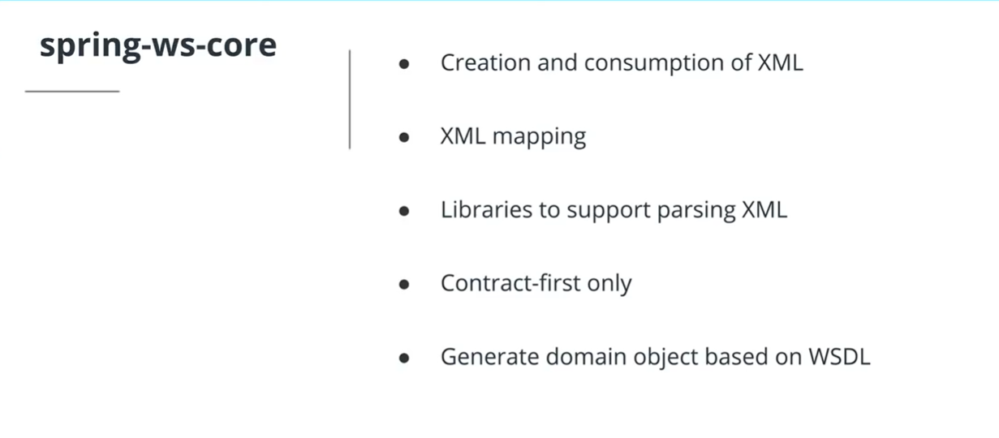

# Consuming REST and SOAP Services

There are times when you want to consume (or call) publicly accessible web services or APIs in your application. If there is a web service or API available that provides the data you need, it doesn’t make sense for you to build one from scratch. This allows you to deliver your products and services faster to your end users.

[RestTemplate](https://docs.spring.io/spring/docs/current/javadoc-api/org/springframework/web/client/RestTemplate.html) allows you to consume a REST API programmatically from your code.

There may be times when you want to consume a SOAP-based web service in your applications. Spring Web Services makes this process easy by automatically generating the files you need in order to consume a SOAP-based web service. In order to generate the files, the WSDL for the SOAP service in question is needed. WSDL stands for Web Services Description Language and simply describes the web service: its location and the operations allowed. Spring Web Services is contract-first only. This means that you need to start from a contract definition (XSD or WSDL) to generate the files.

**Dependencies**
The `spring-boot-starter-web-services` dependency includes the needed dependencies for using Spring Web Services.

**Generate Java Files**
To generate Java classes from the WSDL in maven, you need the following plugin setup:

```xml
    <plugin>
        <groupId>org.jvnet.jaxb2.maven2</groupId>
        <artifactId>maven-jaxb2-plugin</artifactId>
        <version>0.14.0</version>
        <executions>
            <execution>
                <goals>
                    <goal>generate</goal>
                </goals>
            </execution>
        </executions>
        <configuration>
            <schemaDirectory>${project.basedir}/src/main/resources/wsdl</schemaDirectory>
            <schemaIncludes>
                <include>*.wsdl</include>
            </schemaIncludes>
        </configuration>
    </plugin>
```

This plugin uses JAXB, which generates the Java classes and handles the mapping of XML to Java and vice versa. In order to generate the Java files, run the `mvn generate-sources` Maven command. This can easily be done via the command line or through IntelliJ. This results in a number of generated Java classes under `/target/generated-sources/xjc`. Once you have the generated code, you can create a web service client by simply extending the `WebServiceGatewaySupport` class and coding your operations.



## Resources to Test

- Number Convertion to Words - <https://www.dataaccess.com/webservicesserver/numberconversion.wso?WSDL>
- Documentation for the Number To Words SOAP Service - <https://www.dataaccess.com/webservicesserver/NumberConversion.wso?op=NumberToWords>

## Classwork

For this lesson the classwork done is contained in the file ClassWork - ****/Class Work/dogData/**
