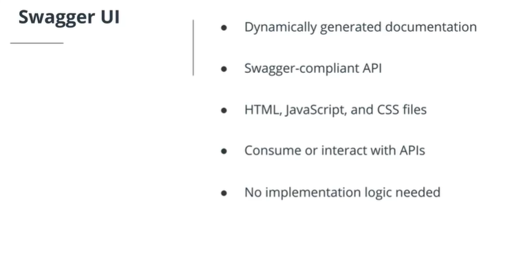

# API Documentation

## Swagger

One of the most popular API documentation specifications is [OpenApi](https://github.com/OAI/OpenAPI-Specification/blob/master/versions/3.0.0.md), formerly known as the Swagger Specification. OpenAPI allows you to describe your API using JSON or YAML. Swagger is the name associated with some of the most well-known, and widely used tools for implementing the OpenAPI specification. Swagger helps you design, build, document and consume REST APIs. SpringFox is a Swagger integration for the Spring Framework.

- Swagger Editor – A browser-based editor where you can write OpenAPI specs.
- Swagger UI – A web application that renders OpenAPI specs as interactive API documentation.
- Swagger Codegen – A tool that generates server stubs and client libraries from an OpenAPI spec.

### Swagger UI



Dynamically generated documentation from a Swagger-compliant API is displayed in the Swagger UI, which consists of HTML, JavaScript, and CSS files. The documentation files are bundled by Swagger UI to display the API in a web browser.

Besides rendering documentation, Swagger UI allows other API developers or consumers to interact with the API’s resources without having any of their implementation logic in place.

#### Dependency

```xml
    <dependency>
        <groupId>io.springfox</groupId>
        <artifactId>springfox-swagger-ui</artifactId>
        <version>2.9.2</version>
    </dependency>

    <dependency>
        <groupId>io.springfox</groupId>
        <artifactId>springfox-swagger2</artifactId>
        <version>2.9.2</version>
        <scope>compile</scope>
    </dependency>
```

### Swagger Configuration

The configuration of Swagger mainly centers around the Docket bean.

```java
    @Configuration
    @EnableSwagger2
    public class SwaggerConfig {

        @Bean
        public Docket api() {
            return new Docket(DocumentationType.SWAGGER_2)
                    .select()
                    .apis(RequestHandlerSelectors.any())
                    .paths(PathSelectors.any())
                    .build();
        }
    }

```

Swagger also provides some default values in its response that you can customize, such as `“Api Documentation”, “Created by Contact Email”, “Apache 2.0”`. To change these values, you can use the `apiInfo(ApiInfo apiInfo)` method.

## Classwork

For this lesson the classwork done is contained in the file ClassWork - ****/Class Work/dogData/**
