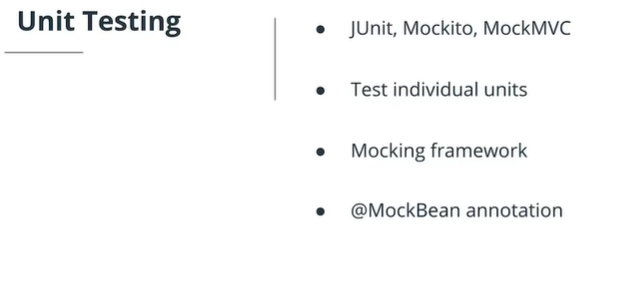

# API Testing

## Unit Testing



We will first look at unit testing REST APIs using JUnit, Mockito and Spring Test (also known as, MockMVC).

- JUnit is a popular unit testing framework that allows you to test individual units of source code.
- Mockito is a great mocking framework which provices data for JUnit tests.
- @MockBean works well with the Mockito library.
- @WebMvcTest is used for controller layer unit testing.

## Integration Testing

Integration testing allows for testing of the entire application (and all of its layers) as opposed to just individual components.

The `@SpringBootTest` annotation is useful for integration testing and is chosen over @WebMvcTest because `@SpringBootTest` starts the full application context (including the server) and does not customize component scanning at all.

`@SpringBootTest` will look for the main configuration class, annotated with `@SpringBootTest` and use that to start a Spring application context that simulates a calling client.

## Further Research Done

- <https://www.briansdevblog.com/2017/05/rest-endpoint-testing-with-mockmvc/>

```java

    @RunWith(SpringRunner.class)
    @SpringBootTest(webEnvironment = WebEnvironment.RANDOM_PORT)
    public class SecuredControllerRestTemplateIntegrationTest {
     
        @Autowired
        private TestRestTemplate template;
     
        // ... other methods
     
        @Test
        public void givenAuthRequestOnPrivateService_shouldSucceedWith200() throws Exception {
            ResponseEntity<String> result = template.withBasicAuth("spring", "secret")
              .getForEntity("/private/hello", String.class);
            assertEquals(HttpStatus.OK, result.getStatusCode());
        }
    }

```

- <https://docs.spring.io/spring-security/site/docs/4.2.x/reference/html/test-mockmvc.html>

## Classwork

For this lesson the classwork done is contained in the file ClassWork - ****/Class Work/dogData/**
