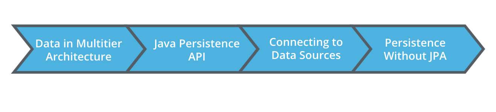

# Introduction to Data Storage and Persistence

## Course Outline

- Design of Data Objects(Entity Designs)
- How to use the the Java Persistence API t make changes to this entities
- Wiring our connections and Applications to external Data Sources
