# Introduction to Multitier Architecture

## Defination of Multitier Architecture

**Multitier Architecture** is a term used to refer to a form of design that separates various functions of the application into their own layers. In this course, we’ll focus on how data in our application is defined and used across these layers.

Entities are used to negotiate between:

- The **object** representation of data in **Java**.
- The **table** representation of data in a **database**.

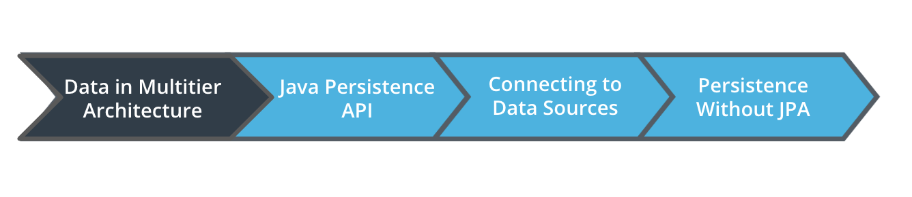

## Entity Design Overview

Programs can represent all kinds of ideas, so the tools we use to describe our data must be flexible. The variables, which are the building blocks of our Entities, are like words that can mean different things to different people. We will use Entities to communicate ideas to our database.

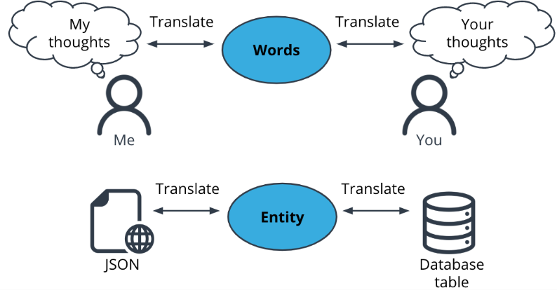

### Java Persistence API (JPA)

A specification describing how to manage relational data.

### Hibernate

An implementation of the JPA Specification. You can access Hibernate’s documentation page here.

### Lesson Outline

1. Value vs. Entity types
2. BasicTypes in Java and JDBC
3. Identifiers
4. Relationships
5. Inheritance

#### Value vs Entity Types

**POJO or "Plain Old Java Object"**
A Java object that contains data, but no methods to describe behavior.

**Entity Types**
Java classes that describe a collection of data.

- Contain Data only, no behavior
- Represented by a table in the database

**Value Types**
The data inside an Entity.

- Primitives like int, boolean, char
- Classes that only represent a single piece of data, like BigInteger or LocalDate
- Represented by a column in the database

`@Entity and @Table Annotations`

> Every entity type would represent a table in the database and the value types would represent columns in the entity containing it

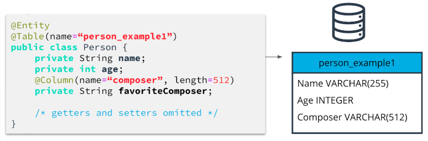

To identify which Java classes we wish to consider as Entities, we added the `@Entity` annotation before the class name. This informs Hibernate that this class should be stored in the database. Each Entity class will be associated with a table of the same name, or you can specify your own table name using the `@Table` annotation at the class level. The attributes of the classes automatically become columns of the same name, and we can change the names and properties of the columns with the `@Column` annotation.

As we can see in this example, we’ve added the `@Entity` annotation to our `Person` class, and we have specified that the `favoriteComposer` field should be stored in a column called “composer”.

One additional point to remember about Entity classes is that they must provide a public or protected no-arg constructor. Java automatically creates one for you if no constructor is specified, but if you create one or more of your own constructors for the class, you’ll also have to make sure to include a no-arg version as well.

**Further Study**
For additional details on mapping types, see the [official Hibernate documentation on mapping types.](https://docs.jboss.org/hibernate/orm/5.4/userguide/html_single/Hibernate_User_Guide.html#mapping-types)

#### Basic Types

Basic Types map a single database column to a single, non-aggregated Java type. Here are some examples of basic types:

Java | JDBC | Hibernate type | Registry Key
---- | ---- | ---- | ----
java.lang.String | VARCHAR | StringType | string
---- | ---- | ---- | ----
java.lang.String | NVARCHAR | StringNVarcharType | nstring
---- | ---- | ---- | ----
int, java.lang.Integer | INTEGER | IntegerTypes | int
---- | ---- | ---- | ----
long, java.lang.Long | BIGINT | LongType | long
---- | ---- | ---- | ----

[Full List of Hibernate standard BasicTypes.](https://docs.jboss.org/hibernate/orm/5.4/userguide/html_single/Hibernate_User_Guide.html#basic)

Hibernate selects default BasicTypes for you, but you can override by specifying the @Type annotation, as below:

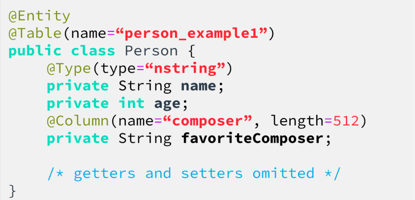

Each BasicType should only map a single value to a single column in the database. Do not attempt to serialize objects or lists of primitives into a single column. Doing so violates First Normal Form of database design, preventing standard relational functioning.

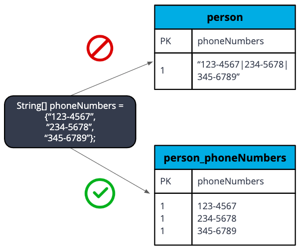

**Serialization**
Transforming your data into a format that can be stored and reconstructed later.

**First Normal form**
Each attribute of a table contains only atomic values.

**Atomic**
Representing a single piece of data; indivisible.

#### Identifiers

All Entities must define an identifier that uniquely identifies them. We express this by using the `@Id` annotation.

```java
    @Entity
    public class Person {
        @Id
        @GeneratedValue
        Long id;
    /* rest of class */
    }
```

Valid identifier types are:

- Any Java primitive type
- Any primitive wrapper type (like `Long`, or `Boolean`)
- A `String`
- `java.sql.Date` or `java.util.Date`
- `java.math.BigDecimal` or `java.math.BigInteger`

The `@GeneratedValue` annotation causes this value to be assigned automatically. For more information about modifying the Id Generation strategy, see the [Hibernate Documentation on Generated Ids](https://docs.jboss.org/hibernate/orm/5.4/userguide/html_single/Hibernate_User_Guide.html#identifiers-generators).

##### Composite Identifiers

Composite identifiers combine multiple attributes to define uniqueness.

###### @EmbeddedId

One way to implement this is by creating an `@Embeddable` class and using @EmbeddedId to identify it in your Entity.

PersonPK.java - The Primary Key Definition

```java

    @Embeddable
    public class PersonPK implements Serializable {
    private int heightCm;
    private String sockColor;

    @Override
    public boolean equals(Object o) {
        if (this == o) return true;
        if (o == null || getClass() != o.getClass()) return false;
        PersonPK personPK = (PersonPK) o;
        return heightCm == personPK.heightCm &&
                sockColor.equals(personPK.sockColor);
    }

    @Override
    public int hashCode() {
        return Objects.hash(heightCm, sockColor);
    }

    /*  getters and setters */
    }

```

Person.java - The Entity

```java
    @Entity
    public class Person {
    @EmbeddedId
    PersonPK id;

    /* rest of class */
    }

```

###### @IdClass

The `@IdClass` annotation allows you to specify a composite primary key by shadowing the fields of your key class in the Entity. This can be useful if you must use an object as a primary key that cannot be `@Embeddable`.

PersonPK.java

```java
    public class PersonPK implements Serializable {
    private int heightCm;
    private String sockColor;

    @Override
    public boolean equals(Object o) {...}

    @Override
    public int hashCode() {...}
    /* getters and setters*/
    }
```

Person.java

```java
    @Entity
    @IdClass(PersonPK.class)
    public class Person {
    @Id
    private int heightCm;
    @Id
    private String sockColor;

    public PersonPK getId() {
        PersonPK id = new PersonPK();
        id.setHeightCm(heightCm);
        id.setSockColor(sockColor);
        return id;
    }

    public void setId(PersonPK id) {
        this.heightCm = id.getHeightCm();
        this.sockColor = id.getSockColor();
    }
    /* getters and setters */
    }
```

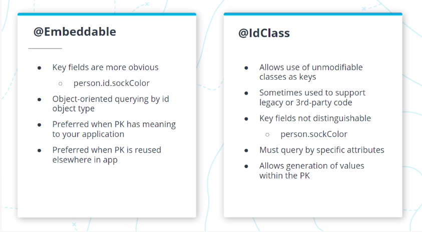

The whole point of using composite identifiers is to identify uniqueness and as such, it is necessary to:

- Override the equals and hash method of the Composite Class as shown above
- Implement Serializable inteface, hibernate requires primary keys to be serializable

Key Note: `@Embeddable` does not support generated ID

#### Relationships

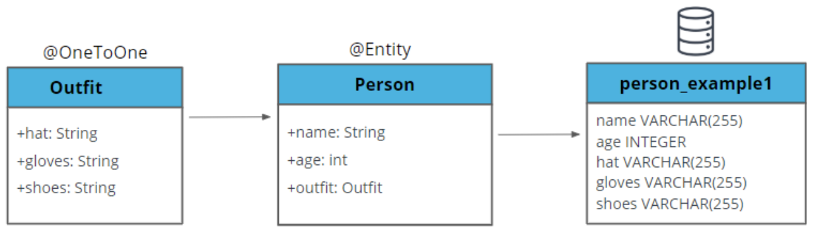
  
##### Ways to Associate Data

- Value Types: Become single columns in containing Entity’s table.
- Embeddables: Add their attributes as columns in the containing Entity’s table.
- Entities: Become new tables which relate to a containing entity by a Join Column.

##### Association Reciprocity

**Unidirectional** - Association specified on one side of the relationship only.

- Doesn't retrieve data you won’t use.
- Should use Set collection type for most efficient SQL.

You only need to specify the Entity on a single side of the relationship. For Example, this is the Person class showing a unidirectional `@OneToMany` relationship to Outfit.

```java
    @Entity
    public class Person {

        @Id
        @GeneratedValue
        private Long id;

        @OneToMany
        private List<Outfit> outfits;

    /* rest of class */
    }

    @Entity
    public class Outfit {

        @Id
        @GeneratedValue
        private Long id;

    /* rest of class */
    }
```

**Bidirectional** - Association specified on both sides of the relationship. Use mappedBy on the containing Entity side.

Both classes have a reference to each other.

- Access both sides of relationship with a single query.
- Hibernate recommends for @OneToMany, because it allows the foreign key constraint to exist only on the table of the contained object.

 Here is a bidirectional OneToMany relationship showing that one person has many outfits, and each outfit has one person.

 ```java
    @Entity
    public class Person {

        @Id
        @GeneratedValue
        private Long id;

        @OneToMany(mappedBy = "person")
        private List<Outfit> outfits;

    /* rest of class */
    }

    @Entity
    public class Outfit {

        @Id
        @GeneratedValue
        private Long id;

        @ManyToOne
        private Person person;

    /* rest of class */
    }

 ```

**`@JoinTable`**
Many associations can be stored in a single @JoinColumn on one of the two entity tables, but you may also elect to store the relationship in a table designated for that purpose. @ManyToMany relationships must use a Join Table, and will automatically create one even if not specified.

To control the name of the table and its columns, you can use the @JoinColumn annotation.

```java
    @Entity
    public class Person {
        @Id
        @GeneratedValue
        private Long id;

        @ManyToMany
        @JoinTable(
            name = "person_outfit",
            joinColumns = { @JoinColumn(name = "person_id")},
            inverseJoinColumns = { @JoinColumn(name = "outfit_id")}
        )
        private List<Outfit> outfits;

    /* rest of class */
    }
```

**`@ElementCollection`**
You can use the @ElementCollection annotation to denote an association between a single Entity and a list of values that are not themselves Entities. This annotation lets you persist Lists of Embeddables or enums, for example. These embeddables will be stored in a separate table, along with the id of the Entity in which they are contained.

```java
    @Entity
    public class Person {
        @Id
        @GeneratedValue
        private Long id;

        @ElementCollection
        private List<Outfit> outfits;

        /* rest of class */
    }

    @Embeddable
    public class Outfit {
        private String hat;
        private String gloves;
        private String shoes;
        private String legs;
        private String top;
    }
```

##### Types of Entity Associations

- **OneToOne**: Single Entity on each side of the relationship.
- **OneToMany** and ManyToOne: List of Entities on one side, single Entity on the other.
- **ManyToMany**: Lists of Entities on both sides.

##### Additional Resources

[Hibernate User Guide on Associations](https://docs.jboss.org/hibernate/orm/5.4/userguide/html_single/Hibernate_User_Guide.html#associations)

#### Inheritance

Inheritance is a way to share data and associations across multiple related classes. This is an example of sharing the association from Person to Outfit with another class by creating a Humanoid parent class.

```java
@Entity
public abstract class Humanoid {
   @Id
   @GeneratedValue
   Long id;

   @OneToMany(mappedBy = "humanoid")
   List<Outfit> outfits;

   /* getters and setters */
}

@Entity
public class Person extends Humanoid {

   @Type(type="nstring")
   private String name;
   private int age;
   @Column(name="composer", length=512)
   private String favoriteComposer;

   /* getters and setters */
}

@Entity
public class CreepyDepartmentStoreMannequin extends Humanoid {

   private boolean hasAHead;
   private MannequinShape mannequinShape;

   enum MannequinShape {
       LITHE, MUSCULUR, UNASSUMING;
   }

    /* getters and setters */
}
```

##### Single Table Inheritance

The default inheritance strategy used by Hibernate is Single Table inheritance. All the fields of the parent and children classes are stored in the same table. Allows the fastest polymorphic queries because no tables need to be joined to access all subclasses. Cannot support Not Null column constraints because columns must be able to contain null for sibling classes.

##### Polymorphic Query

A query for the parent class that returns elements of all subclass types.

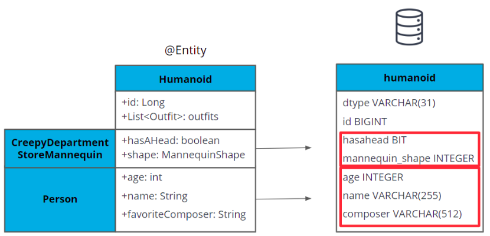

##### Other Inheritance Strategies

###### Joined vs Table Per Class

You can specify other inheritance strategies using the `@Inheritance` annotation on the parent class. The valid choices are `InheritanceType.SINGLE_TABLE`, `InheritanceType.JOINED`, and `InheritanceType.TABLE_PER_CLASS`.

```java

@Entity
@Inheritance(strategy = InheritanceType.JOINED)
public class Humanoid {
   @Id
   @GeneratedValue
   Long id;

   @OneToMany(mappedBy = "humanoid")
   List<Outfit> outfits;

   /* getters and setters */
}
```

**JOINED**
Creates a table for the parent class and each subclass. The subclass tables only have fields unique to their class. Supports polymorphic queries by UNIONing subclass tables. Uses the least space of the solutions that allow Not Null columns.

**TABLE_PER_CLASS**
Creates a table for the parent class and each subclass. The subclass tables have all fields from the parent class as well as fields unique to their class. Supports polymorphic queries by UNIONing subclass tables, but does not require any UNION to access superclass fields on non-polymorphic queries.

**Mapped Superclass**
This is selected by using the `@MappedSuperclass` annotation on the parent class instead of `@Entity`. It creates a table per class just like TABLE_PER_CLASS, but there is no superclass table. It does not support polymorphic queries, but never requires UNIONS to query subclasses.

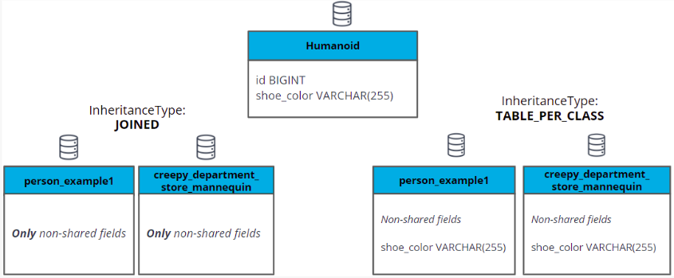

###### Summary

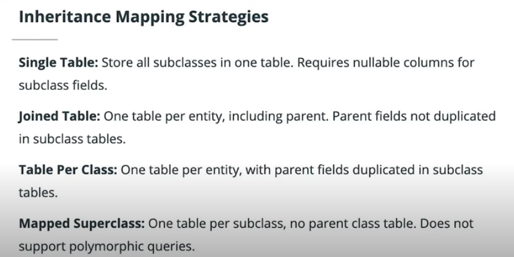

> Joined inheritance allows us to apply column not null constraints while offering decent performance on Polymorphic queries and less redundant columns than TABLE_PER_CLASS
> Single Table is the fastest and simplest inheritance strategy and should be considered a good choice whenever you don’t need to constrain the values of the columns in a way that differs by subclass.
>TABLE_PER_CLASS is a good option for situations where you want your subclass tables to contain all the data in one place and want to enforce column constraints. It’s preferable to Mapped Superclass for most cases, because it leaves you the option of making polymorphic queries if you need to in the future.

**Additional Resources**
[Hibernate documentation on Inheritance](https://docs.jboss.org/hibernate/orm/5.4/userguide/html_single/Hibernate_User_Guide.html#entity-inheritance)

## Entity Role in Multitier Architecture

Entities belong in the Data layer, as their primary role is bridging the communication between our Application layer and the database. They also serve as components of business logic, making them relevant components in our controller and service layers.

The Application layer should not communicate with the database, and the Data layer should not execute business logic.

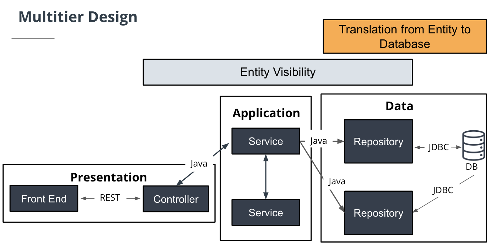

### Multitier Architecture Advantages

Maintenance

- Centralizes access to your data source
- Reduces time needed to make changes to Entity interactions
- Reduces amount of code each developer needs to understand

Performance

- Allows application layers to easily be separated into modules
- Reduces application size
- Enables scaling of independent components
- Supports future architecture deployment

Security

- Able to secure each tier with different permissions
- Reduces redundant authentication in other tiers

## Data Conversion

### Data Transfer Objects (DTOs)

Data structures designed to represent the needs of the front end.

#### DTO Summary

- Simplify and document interaction between front end and Controller.
- Conceal database structures.
- Limit the amount of data exchanged.
- Customize display data to meet the needs of the front end.

### JSONView Annotations

Annotation that filters which Entity data is visible to the Presentation layer.

#### @JSONView Summary

- Quickly specify which parts of Entities should be visible to which consumer.
- Often a simple choice when controlling full stack.
- Not as helpful when you need to combine data from multiple Entities.
- Can require Entity updates if front end needs change.
- Often grouped together in a Views class, containing interfaces such as ‘Public’, ‘Private’, or interfaces named for specific endpoint recipients.

## Glossary

### Multitier Architecture

Refers to a form of design that separates various functions of the application into their own layers.

### Java Persistence API (JPA): Glossary

A specification describing how to manage relational data.

### Hibernate: Glossary

An implementation of the JPA Specification. You can access Hibernate’s documentation page here.

### POJO or "Plain Old Java Object"

A Java object that contains data, but no methods to describe behavior.

### Entity Types: Glossary

- Java classes that describe a collection of data.
- Contain Data only, no behavior
- Represented by a table in the database

### Value Types: Glossary

- The data inside an Entity.
- Primitives like int, boolean, char
- Classes that only represent a single piece of data, like BigInteger or LocalDate
- Represented by a column in the database

### Basic Types: Glossary

Basic Types map a single database column to a single, non-aggregated Java type.

### Serialization

Transforming your data into a format that can be stored and reconstructed later.

### First Normal form

Each attribute of a table contains only atomic values.

### Atomic

Representing a single piece of data; indivisible.

### Embeddables

Add their attributes as columns in the containing Entity’s table.

### Entities

Become new tables which relate to a containing entity by a Join Column.

### Unidirectional

- Association specified on one side of the relationship only.
- Doesn't retrieve data you won’t use.
- Should use Set collection type for most efficient SQL.

### Bidirectional

- Association specified on both sides of the relationship. Use mappedBy on the containing Entity side.
- Access both sides of relationship with a single query.
- Hibernate recommends for @OneToMany, because it allows the foreign key constraint to exist only on the table of the contained object.

### OneToOne

Single Entity on each side of the relationship.

### OneToMany and ManyToOne

List of Entities on one side, single Entity on the other.

### ManyToMany

Lists of Entities on both sides.

### Inheritance: Glossary

Inheritance is a way to share data and associations across multiple related classes.

#### Single Table Inheritance: Glossary

The default inheritance strategy used by Hibernate. All the fields of the parent and children classes are stored in the same table. Allows the fastest polymorphic queries because no tables need to be joined to access all subclasses. Cannot support Not Null column constraints because columns must be able to contain null for sibling classes.

#### Polymorphic Query: Glossary

A query for the parent class that returns elements of all subclass types.

#### Joined Inheritance: Glossary

Creates a table for the parent class and each subclass. The subclass tables only have fields unique to their class. Supports polymorphic queries by UNIONing subclass tables. Uses the least space of the solutions that allow Not Null columns.

#### Table Per Class Inheritance

Creates a table for the parent class and each subclass. The subclass tables have all fields from the parent class as well as fields unique to their class. Supports polymorphic queries by UNIONing subclass tables, but does not require any UNION to access superclass fields on non-polymorphic queries.

#### Mapped Superclass

This is selected by using the @MappedSuperclass annotation on the parent class instead of @Entity. It creates a table per class just like TABLE_PER_CLASS, but there is no superclass table. It does not support polymorphic queries, but never requires UNIONS to query subclasses.

### Data Transfer Objects (DTOs): Glossary

Data structures designed to represent the needs of the front end.

### JSONView Annotations: Glossary

Annotation that filters which Entity data is visible to the Presentation layer.
