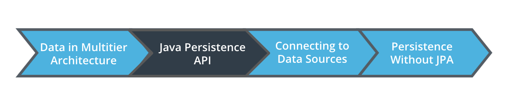
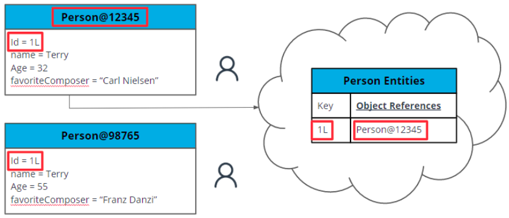
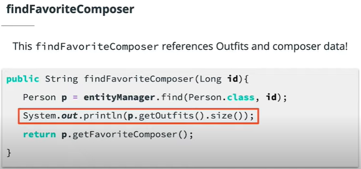

# Introduction to Data Storage and Persistence

## Lesson Outline



- Persistence Context
- Entity Manager
- Queries and JPQL
- Projections
- Repository Pattern
- Spring Data JPA
- Transactions and Flushing

## Definitions

**Java Persistence API (JPA)**: A specification describing how to manage relational data
**Hibernate**: An implementation of the JPA Specification

## Note about JPA rebranding

JPA changed names in 2018 when Java EE was rebranded to Jakarta EE in an effort to separate the Enterprise Edition development from ongoing trademark issues surrounding the term Java in their framework name. Java EE, or Jakarta EE now, fills a similar role to Spring in that it provides a large number of tools to enable enterprise-scale projects. One of those tools is JPA, now Jakarta Persistence API (but, conveniently, still the same letters). Just something to keep in mind when searching for more info.

## Persistence Context

In order to know if chnages we make to an entity should be applied to a database, we need to know of the relationship with that entity and the table storing it. We store this information inside somethimg called the **Persistence Context**.

**Persistence Context**: Describes the relationship between all the Entity *instances* in our program and their representations in the underlying database.

**Instances**: A specific copy of an Entity that has been instantiated in program memory.

That is there can be more than one instance of an entity at any point in time all with their own unique state. JPA uses the entity Id to keep track of the entity's state in the persistence context

### Persistence Context Entity States

**Transient**: refers to instances that are not associated with the persistence context. Often has not yet had an ID assigned.
**Managed**: Also called persistent. Managed by the current persistence context. Changes to the entity will be reflected in the backing database.
**Detached**: means that the enitity was previously managed. Occurs to all managed entities when persistence context ends. Entities can also be evicted from the persistence context if desired.
**Removed**: scheduled to be removed from the database. Java object still exists and has ID. The persistence Context knows that it will no longer correpond to a row in the database



Besides Managing these states, the Persistent context knows all the operations requested for it's managed entities
It also serves as a first level cache between the application and the database, what this means is that any changes you make to an entity within the same persistence context can simply operate on the same Java Objects without having to interact with the database.

> New objects and objects created by requests to your controller layer will start in the Transient state
> Any changes to an Entity in the managed state will automatically be applied to the database.

### Additional Resources on Persistence Context

[Hibernate Documentation on Persistence Context](https://docs.jboss.org/hibernate/orm/5.4/userguide/html_single/Hibernate_User_Guide.html#pc)

## Entity Manager

An interface used to move entities between the states described aboove.

### Changing Persistence States

**Persist**: Takes an Entity not yet managed. The Entity becomes managed and will be saved to the database.
**Find**: Looks up an id in the database and returns a managed Entity.
**Merge**: Updates an Entity that is in the detached state. Returns an instance of that Entity that is now managed. If Entity was not found in the database to update, persists Entity as a new row.
**Remove**: Detaches an entity from the managed State and deletes it from the database.

Example Code

```java
@PersistenceContext
EntityManager entityManager;

public void persistExample(Person p) {
   entityManager.persist(p); //write p to the database
   p.setFavoriteComposer("Johann Strauss II"); //will update database
}

public void findExample(Long id) {
   Person p = entityManager.find(Person.class, id); //retrieve an instance by its key
   p.setFavoriteComposer("Sir Malcolm Arnold"); // will update database
}

public void getReferenceExample(Long personId, Long outfitId) {
   Person p = entityManager.find(Person.class, personId);
   Outfit outfitReference = entityManager.getReference(Outfit.class, outfitId);
   p.getOutfits().add(outfitReference);
}

public void mergeExample(Person detachedPerson){
   detachedPerson.setFavoriteComposer("Rimsky Korsakov");
   Person managedPerson = entityManager.merge(detachedPerson);
   detachedPerson.setFavoriteComposer("Antonio Salieri"); //will have no effect on database
   managedPerson.setFavoriteComposer("C.P.E. Bach"); //will overwrite Korsakov
}

public void deleteExample(Long id) {
   Person p = entityManager.find(Person.class, id); //retrieve an instance by its key
   entityManager.remove(p); //will delete row from database
}
```

### Note about Hibernate Session

Hibernate exposes some methods beyond those specified in the JPA API. Hibernate-specific methods can be accessed through an object called Session, which is the Hibernate implementation of EntityManager. You can acquire a Session object by using the method `entityManager.unwrap(Session.class)`. You can use Session to access some Hibernate’s own implementation methods. See [the Hibernate documentation on Persistence Context](https://docs.jboss.org/hibernate/orm/5.4/userguide/html_single/Hibernate_User_Guide.html#pc) for more details about Session as well as the above four methods.

## Lazy Loading

Setting a fetch strategy can prevent your Entities from loading associated values until those values are referenced.

### FetchType.EAGER

Always retrieve the associated values as part of the Entity retrieval. This means the initial query for the entity retrieves this data.

### FetchType.LAZY

Wait to retrieve associated values until they are referenced. Lazy-loaded attributes are Hibernate proxy objects whose specific values are retrieved from the database only if they’re accessed. The initial query for the entity will NOT retrieve this data.

### Example Usage



```java
@Entity
public class Person {

    @Id
    @GeneratedValue
    Long id;

    @OneToMany(mappedBy = "person", fetch = FetchType.LAZY)
    private List<Outfit> outfits;

    private String name;
    private int age;
    private String favoriteComposer;

    /* rest of class */
}
```

### Default Values

An easy way to remember this is that both associations mapping to Many objects default to Lazy, because it’s more costly to retrieve lots of objects from the database. Associations mapping to One object default to Eager, because there’s usually less information.

**FetchType.LAZY:**

- @OneToMany
- @ManyToMany

**FetchType.EAGER:**

- @ManyToOne
- @OneToOne

### Additional Resources on Lazy Loading

[Hibernate documentation on Fetching](https://docs.jboss.org/hibernate/orm/5.4/userguide/html_single/Hibernate_User_Guide.html#fetching)

## Cascading

CascadeType allows us to modify Entity associations so that persistence operations on one Entity will cascade to other Entities associated with it.

### Example Usage of CascadingTypes

```java
   @Entity
   public class Person {

      @Id
      @GeneratedValue
      Long id;

      @OneToMany(mappedBy = "person", cascade = CascadeType.ALL)
      List<Outfit> outfits;

      private String name;
      private int age;
      private String favoriteComposer;

   /* rest of class */
```

Valid CascadeTypes correspond to the different persistence operations, such as Persist, Merge, and Remove. See the [Hibernate cascade documentation](https://docs.jboss.org/hibernate/orm/5.4/userguide/html_single/Hibernate_User_Guide.html#pc-cascade) for more details.
