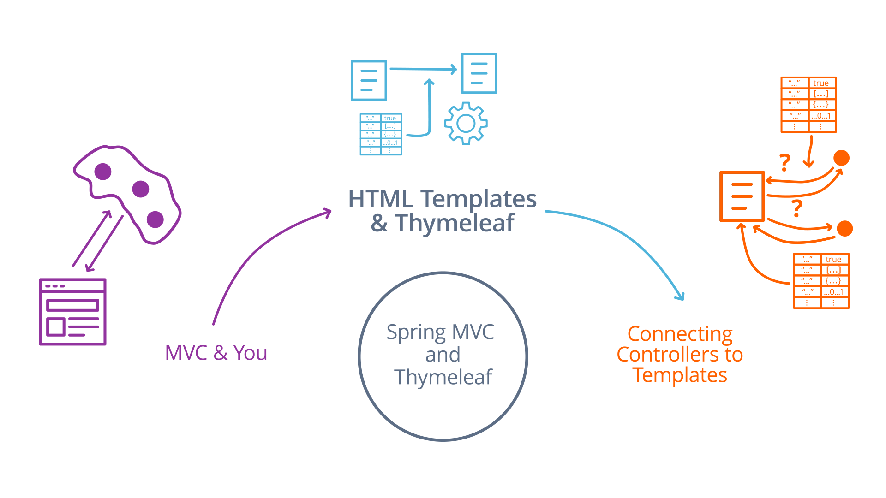
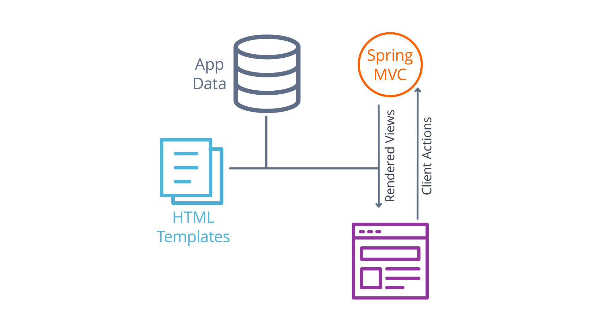
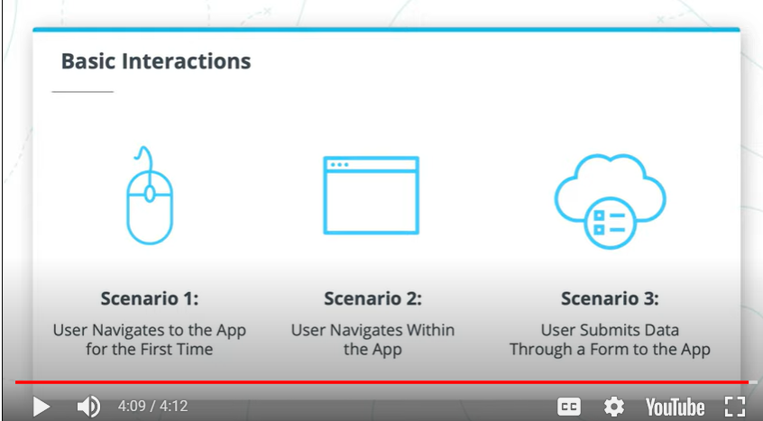
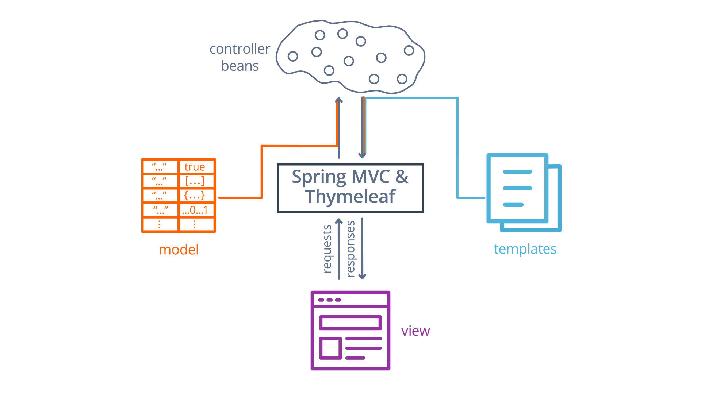
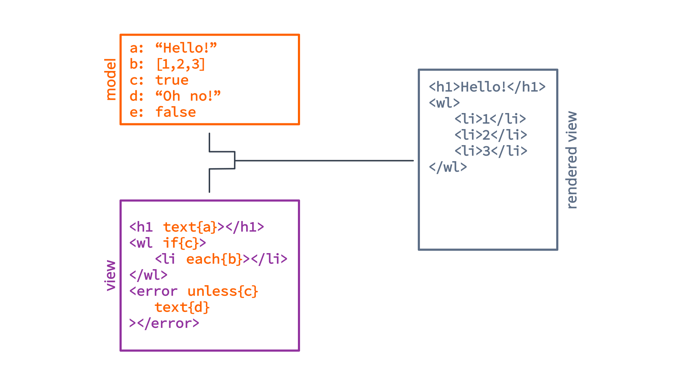
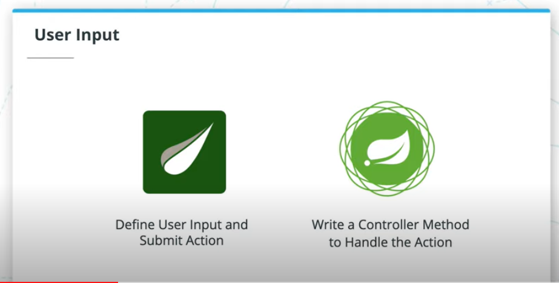

# Spring MVC and Thymeleaf

## What to Learn



## Lesson Outline

* **MVC and You**: We introduce the model-view-controller pattern and discuss how Spring MVC adapts it for use on the web.
* **HTML Templates and Thymeleaf**: We look at how Thymeleaf's HTML templates work and how we can populate them with data using Spring controllers.
* **Connecting Controllers to Templates**: We dive deeper into the relationship between controllers and templates to see how to bind data from a web form to a controller method.

## Developing Websites from the Backend



The figure above shows the relationship between Spring MVC and the client. Spring MVC uses HTML templates and application data to render a view for the client browser to display. The view exposes certain actions to the user, which when triggered are sent to Spring MVC, which processes the actions and renders new views for the client.

### Interacting with a simple web application

In a web application, there are two components: the client that sends HTTP requests, and the server, which sends HTTP responses back. In the case of a web browser client, the responses the server sends need to be in the format of HTML, the document language of the web. The HTML that is sent to the client both defines the data that the user sees, as well as the actions a user can take - things like buttons, links, and input forms are all part of what the server is responsible for generating.

This process of generating an entire UI from HTML would be tedious if we had to do it by hand. Luckily, we don't have to - Thymeleaf is an HTML template engine that, when used with Spring MVC, can simplify things greatly.

### HTML templates

HTML templates are essentially just HTML files with special tags and attributes that can be combined with a data model by a template engine like Thymeleaf to generate fully functional HTML documents. Spring MVC provides a standard way to choose a template and supply the necessary data model when a request comes in, which allows for a truly dynamic user experience.

> Data model defines how the application stores and retrieves (serialize and deserialize) the Java objects into/from the database. Data modeling starts with designing the database tables which are analogous to the Java classes ("model" classes of the MVC).

You'll learn and practice HTML templates in the current lesson, and data model in the Data Persistence lesson.

### Key Terms on Developing Websites from the Backend

* **`GET` Request**: an HTTP request for data at a specific URL. This type of request cannot include any additional data.
* **`POST` Request**: and HTTP request that usually represents "posting" new data to the server. This is a common catch-all request method used for many data-bearing requests to the server.
* **Dynamic**: Something that is dynamic changes in response to external stimuli. In the case of HTML templates, dynamic sections of the template are ones that can be replaced or configured with data on-demand.
* **Static**: Something that is static does not change. In the case of HTML templates, static sections of the template are the ones that cannot be changed and will be the same no matter what data is used with the template.
* **MVC**: **M**odel-**V**iew-**C**ontroller, a design pattern that emphasizes the separation of application components into those three categories or layers for more-structured user-facing application development.

## Servers, Templates and MVC

### Basic User Interactions



There are three basic scenarios that comprise the majority of web-based user interaction flows.

1. The first is when a user follows a link to our application from an external source, like a marketing email or google search. This kind of cold-call request means will always be a `GET` request, and our application's responsibility is to choose a response template (appropriate for the request URL - you don't want to send the `register.html` if the link the user clicked was for `/shopping-cart`!) and populate it with relevant application data.
2. The second scenario is when a user navigates within our app, either by clicking a link or a button or performing some action we need to process on the server, like adding an item to their shopping cart. This case is very similar to the first, as it involves the server choosing a response template and populating it with data, but in this case, the action the user performs is completely up to us - since they're initiating the action from a web page we designed, only the actions we included in that design are available. We can use this to add additional data to requests at the template-level, for example by generating each "add item to cart" button to include the item's identifier in the request that is sent.
3. The final scenario is when the user submits completely custom data to our app using form input. This is again similar to the previous two, in that the exact shape of the form is something our template design determines, and that we still need to choose a template to send in response and the data we should use to populate this template. The main difference is that the request no longer includes "safe" data - when a user can enter any data that they'd like, our application is responsible for vetting and validating that data, showing the user an error if something goes wrong.

These scenarios may seem simple, but they are the building blocks of web development. Regardless of the application, user interaction flows on the web are all built out of these basic building blocks.

### MVC and You

MVC is an acronym that stands for Model-View-Controller, and it's a common software pattern for user interface design. Traditionally, it divides the roles of components in an app into three layers:

* the **Model**, which is responsible for maintaining the state of an application,
* the **View**, which is responsible for displaying the UI to the user,
* and the **Controller**, which is responsible for processing user actions (sent from the View) to update the Model, and for forwarding those updates back to the View

MVC is an abstract pattern, though, and every library implements it differently. Spring MVC is built around the browser as a platform, and it organizes these roles like this:

* **HTML templates** are the views - each one represents a specific screen or screen component that the user is shown.
* **Spring beans** are the controllers - specifically, Spring MVC gives an @Controller annotation that we can use to register our beans as controllers. Think of Spring bean controllers as specialized application components that can define methods to handle specific user requests. Those methods are responsible for choosing the HTML template that is generated in response, as well as for populating the Model object for that template.
* **`Model` objects** are the models - every controller method can take an optional Model argument, and by reading and changing the data inside of it, the controller can read user-submitted data and populate the template with the changes. Think of the Model class a simple data-transfer object: something that can store various bits of data with keys to look that data up, and that can be passed between the browser, the template engine, and the controller to facilitate the transfer of data between the user and the application.

#### The Spring MVC Architecture



The figure above shows the Spring MVC's architecture. The browser represents the view, and requests from the browser are user actions. When Spring MVC processes a request, it creates a Model object that represents the dynamic data associated with the view and passes it to a controller method that matches the request. The controller updates the model and chooses a template to render in response. Spring MVC passes the template and the updated model to Thymeleaf, which generates an updated view, which Spring sends in response to the browser.

#### Key Terms on MVC and You

* **MVC**: MVC is an acronym that stands for Model-View-Controller, and it's a common software pattern for user interface design
* **Model**: in MVC, the Model is responsible for maintaining the state of an application,
* **View**: in MVC, the View is responsible for displaying the UI to the user,
* **Controller**: in MVC, the Controller is responsible for processing user actions (sent from the View) to update the Model, and for forwarding those updates back to the View
* **Template**: In software development, templates are used in many different contexts - in general, they are a way to define some often-repeated or reused text or code in a specific format, like HTML, along with code hooks that indicate portions of the template that should be replaced dynamically when the template is rendered. In our context, we mostly use Thymeleaf's HTML templates, which mostly look like plain HTML with a few extra Thymeleaf-specific attributes. These attributes are our code hooks, and allow us to define what data Thymeleaf uses when generating the final HTML from our template.

#### Further Research on MVC and You

* **[Getting Started - Tutorial on Serving Web Content with Spring MVC](https://spring.io/guides/gs/serving-web-content/)** - This tutorial will walk you through many new concepts that you will learn next in this course.
* **[High-level Overview of Different MVC Variants](https://uniandes-se4ma.gitlab.io/books/chapter8/mvc-mvvm-mv-mvwhat.html)**

## HTML Templates with Thymeleaf



The figure above shows how Thymeleaf renders a view. In order to render a view, Thymeleaf must be given a template and a model to use. Thymeleaf scans through the template to find dynamic data expressions and resolves the variables in those expressions using the model. Some dynamic data expressions result in iterated or conditional rendering in addition to more typical text replacement.

### Key Terms on HTML Templates: Thymeleaf View Rendering

* **User Action**: Broadly, a user action is simply some specific action a user can take, provided by the user interface they're interacting with. In the case of web applications, we usually think of user actions as clicks on a web page that often result in a HTTP request sent to the backend.
* **Prototype/Wireframe** In the development process for a web application, it's common to first design the full HTML and CSS for all of the screens a user is expected to see. These pages have no actual functionality, and are usually called prototypes. Wireframes are an even earlier product of the design process, and usually are simple images that show what the prototypes should look like.

### Further Reading on HTML Templates: Thymeleaf View Rendering

* **[The official Thymeleaf tutorial](https://www.thymeleaf.org/doc/tutorials/3.0/usingthymeleaf.html#introducing-thymeleaf)**, which explains the entire framework from first principles.
* **[The official Thymeleaf expression syntax tutorial](https://www.thymeleaf.org/doc/tutorials/3.0/usingthymeleaf.html#standard-expression-syntax)** - Read this section if all those `${}`s aren't making much sense to you.
* **[The official Spring Expression Language docs](https://docs.spring.io/spring/docs/4.3.10.RELEASE/spring-framework-reference/html/expressions.html)** - This will tell you how to perform various computations inside of the Thymeleaf expression brackets

## Connecting Controllers to Templates

### Video Lessons on Connecting Controllers to Templates



The final piece of the Spring MVC puzzle we need to build fully capable web apps is the ability to handle user-submitted data. As before, there are two main components to this, one on the template side, the other on the controller side.

On the template side, we need to define input fields for each piece of data we want to capture, and a `<form>` element to group them. When the form is submitted, the data will be encoded in the HTTP request that is sent, and can be extracted on the Spring side.

On the Spring side of things, we need to define a POJO to hold the form data. We'll look at code details in the next video, but by defining this POJO we can pre-fill the form by setting its fields and adding it as a Model attribute when first rendering the template, and Spring can automatically extract the request data into that POJO when the form is submitted. Let's see how that works!

#### User-Inputted Data

```html
<form th:object="${newMessage}" th:action="@{/home}" action="#" method="POST">
    <input th:field="*{text}" type="text">
    <input type="submit">
</form>

```

We use the `th:object` attribute to choose the POJO our form data should be added to, and the `th:action` attribute to choose the URL to send the form submission HTTP request to. We use the special `@{}` syntax in the latter to tell Thymeleaf to make sure the URL is always relative to the actual server address - this doesn't make a huge difference in our current project, but it's good practice when referring to URLs on our server in a Thymleaf template.

We also set `method="POST"` on the form to set the HTTP method of the resulting request. This is important! Remember that `GET` requests cannot contain any custom data - we need to use `POST` for our form data to actually get sent!

In order to bind the individual form input data fields to the form-backing POJO's fields, we need to add the th:field attribute. We also need to use another special Thymeleaf expression syntax - `*{}`. This allows us to refer to fields on the form-backing POJO without using dot syntax - `th:field="*{text}"` in this example is equivalent to `th:field="${newMessage.text}"`.

```java
    @GetMapping("/home")
    public String getHomePage(@ModelAttribute("newMessage") MessageForm newMessage, Model model) {
        model.addAttribute("greetings", this.messageListService.getMessages());
        return "home";
    }

    @PostMapping("/home")
    public String addMessage(@ModelAttribute("newMessage") MessageForm messageForm, Model model) {
        messageListService.addMessage(messageForm.getText());
        model.addAttribute("greetings", messageListService.getMessages());
        messageForm.setText("");
        return "home";
    }

    // See src files for this lesson for the POJO class of MessageForm and MessageListService
```

The key elements to focus on are the new arguments to each of these methods - the `MessageForm` class is a POJO specifically designed to hold the form data we defined in the previous video.

For the `GET` request handling method, we declare the `MessageForm` argument to ensure that the object exists and is added to the model by Spring automatically. This is necessary, because Thymeleaf needs an object with the name `newMessage` to be present in the model to render properly, even if there isn't any data in the object yet.

For the `POST` request handling method, we declare the `MessageForm` argument to tell Spring that it should look for data that matches that in the body of the request we're handling. Spring will then automatically extract that data and put it in a `MessageForm` object before calling our method, passing it to us so we can use the data as we see fit.

In both cases, we're annotating this argument with `@ModelAttribute`. This allows us to specify that Spring should add the object to our `Model` before asking Thymeleaf to render the template. That means we don't have to add it manually! Pretty handy.

### Key Terms on Connecting Controllers to Templates

* **Form-Backing Object**: This is a term used by Spring MVC and Thymeleaf to mean an object that represents the data contained in a form. On the Spring side, this is usually an additional argument to the relevant Controller method, and on the Thymeleaf side, this is referred to in the `th:object` attribute on the form.

FUNCTION | ATTRIBBUTE OR ANNOTATION
-------- | --------
Identify form elements that capture user data | `th:field`
Identify objects that contain form data | `@ModelAttribute`
Identify which endpoint to call on form submission | `th:action`
Identify the path for a given controller | `@RequestMapping`
-------- | --------

### Further Research on Connecting Controllers to Templates

* [Official Spring MVC docs with some discussion of form-backing objects.](https://docs.spring.io/spring/docs/3.2.x/spring-framework-reference/html/mvc.html)
* [Official Thymeleaf docs for writing forms and integrating with Spring.](https://www.thymeleaf.org/doc/tutorials/2.1/thymeleafspring.html#creating-a-form)

## Special Inputs

Sometimes when we build web applications with Spring, we need to account for special request types and data formats. The key takeaway from this edge case is that usually, we can accomplish this by adding the correct argument to our controller method. In this example, we looked at `MultiPartFile`, a special request data class provided by Spring to handle large file uploads. As with any special data type, simply by adding it as an argument to our controller method, Spring knows to treat the incoming request appropriately.

On the Thymeleaf side of things, we also learned how to set up a form for file upload using the `enctype="multipart/form-data"` attribute. This is another important takeaway - when we want to send special data types from the frontend to Spring, we need to find out how to configure the form properly.

This specific example will be relevant in the final project, but in general, be on the lookout for cases where you might need to handle special request data. Implementing it might take some research!

### Further Research on Special Inputs

* **[Official Spring MultiPartFile Javadocs](https://docs.spring.io/spring/docs/current/javadoc-api/org/springframework/web/multipart/MultipartFile.html)**
* **[Official Spring MVC file upload tutorial](https://spring.io/guides/gs/uploading-files/)**
